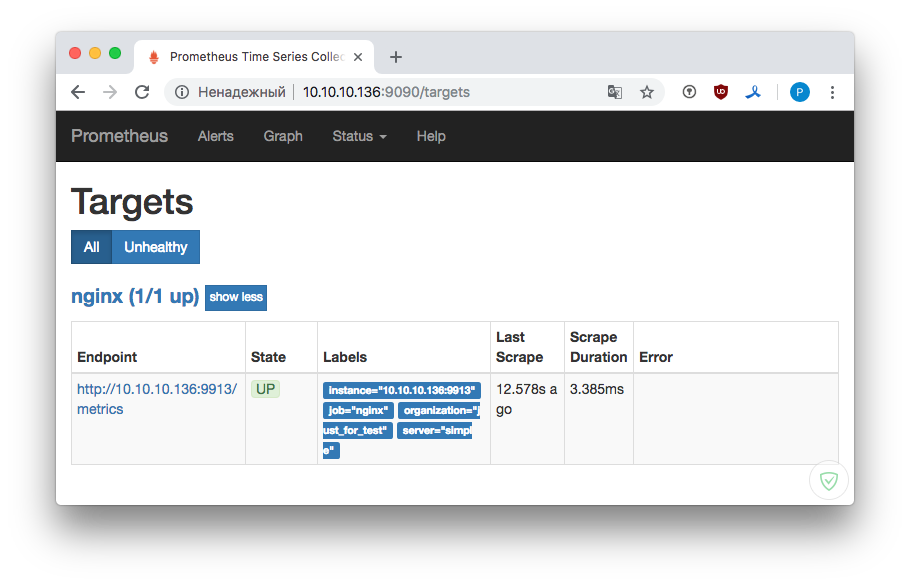
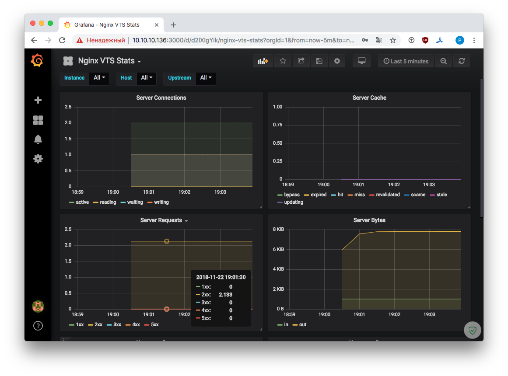

## Управление пакетами. Дистрибьюция софта. 

#### 1. Создать свой RPM пакет

Будем собирать nginx-1.15.6 из mainline ветки, с библиотекой openssl-1.1.1a и модулем для получения статистики nginx-module-vts-0.1.18.

Все необходимые инструменты для сборки пакетов поставились при создании VM - см. [Vagrantfile](https://github.com/kakoka/otus-homework/blob/master/hw08/Vagrantfile).

В рекомендациях по сборке пакетов говорится, что сборка пакетов из-под `root` крайне опасная операция. Поэтому заведем пользователся `builder` из-под которого и будем собирать наш пакет и сразу переключимся в него.

```
$ sudo useradd builder && passwd builder
$ sudo usermod -a -G builder builder
$ su -u builder
```

Создадим иерархию каталогов для сборки: 

```
$ rpmdev-setuptree
$ tree
```
<pre>
`-- rpmbuild
    |-- BUILD
    |-- RPMS
    |-- SOURCES
    |-- SPECS
    `-- SRPMS
</pre>

Добавим удаленный репозиторий nginx, в котором есть исходники текущей версии [см. документацию](http://nginx.org/en/linux_packages.html#mainline): 

```
$ sudo vi /etc/yum.repos.d/nginx.repo
```

<pre>
[nginx-source]
name=nginx source repo
baseurl=http://nginx.org/packages/mainline/centos/7/SRPMS/
gpgcheck=0
enabled=1
</pre>

Скачаем последнюю версию исходников, после соберем все зависимости, необходимые для сборки nginx:

```
$ yumdownloader --source nginx
$ sudo yum-builddep nginx
```

Распакуем пакет с исходниками:

```
$ rpm -Uvh nginx-1.15.6-1.el7_4.ngx.src.rpm
```

Дополнительно потребуются исходники следующих модулей:

* nginx-module-vts-0.1.18
* openssl-OpenSSL_1_1_1a

Скачаем их и положим в папку `~rpmbuild/SOURCES`:

```bash
$ cd ~rpmbuild/SOURCES
$ wget https://github.com/openssl/openssl/archive/OpenSSL_1_1_1a.tar.gz
$ wget https://github.com/vozlt/nginx-module-vts/archive/v0.1.18.tar.gz
```

Далее, нам необходимо внести изменения в файл nginx.spec, а именно:

* укажем источники исходников для библиотеки и модуля, куда положить распакованные исходники
* укажем с какими опциями собрать модули для nginx (секции - sources, setup, build).

<pre>
Source14: OpenSSL_1_1_1a.tar.gz
Source15: v0.1.18.tar.gz
...
%setup -T -D -a 14
%setup -T -D -a 15
...
--with-openssl=%{_builddir}/%{name}-%{version}/openssl-OpenSSL_1_1_1a \
--add-module=%{_builddir}/%{name}-%{version}/nginx-module-vts-0.1.18
</pre>

```bash
$ rpmbuild -ba ~/rpmbuild/SPECS/nginx.spec
```

Минут за 10 собрался пакет:

<pre>
$ ll ~/rpmbuild/RPMS/x86_64/
total 6736
-rw-rw-r--. 1 builder builder 3934760 Nov 21 17:49 nginx-1.15.6-1.el7_4.ngx.x86_64.rpm
-rw-rw-r--. 1 builder builder 2960524 Nov 21 17:49 nginx-debuginfo-1.15.6-1.el7_4.ngx.x86_64.rpm
</pre>

Заметки:

* %setup - распаковывает исходники библиотеки и модуля внуть папки первого Source [то есть сначала распаковывается архив с исходниками nginx, внутрь него распаковывается следующий, указанный], опция `-a #` указывает к какому Source мы применили это правило установки.
* [Вот тут подробнее обо всех опциях](http://wiki.rosalab.ru/ru/index.php/%D0%A1%D0%B1%D0%BE%D1%80%D0%BA%D0%B0_RPM_-_%D0%B1%D1%8B%D1%81%D1%82%D1%80%D1%8B%D0%B9_%D1%81%D1%82%D0%B0%D1%80%D1%82)
* [RPM команды, шпаргалка](http://linux-notes.org/komanda-rpm-v-primerah)
* [YUM шпаргалка](https://habr.com/post/301292/)

#### 2. Создать репозиторий и разместить RPM пакет

Создадим директорию для размещения репозитария и поместим туда наш пакет.

```bash
$ mkdir -p /opt/localrepo && mkdir -p /opt/repo/{RPMS,SRPMS} && mkdir -p /opt/localrepo/RPMS/x86_64  
$ cp nginx-1.15.6-1.el7_4.ngx.* /opt/localrepo/RPMS/x86_64
```

Создадим репозиторий:

```bash
$ createrepo -v /opt/localrepo/
```

Добавим `/etc/yum.repos.d/vts.repo`.

<pre>
[vts]
name=local vts repo 
baseurl=file:///opt/localrepo
gpgcheck=0
enabled=1
priority=1
</pre>

Проверим:

```bash
$ yum repo-pkgs vts list
```

<pre>
Loaded plugins: fastestmirror
Loading mirror speeds from cached hostfile
 * base: dedic.sh
 * extras: mirror.tversu.ru
 * updates: dedic.sh
Available Packages
nginx.x86_64             1:1.15.6-1.el7_4.ngx     vts
nginx-debuginfo.x86_64   1:1.15.6-1.el7_4.ngx     vts
</pre>

Поставим наш пакетик, проверим его работоспособность.

```bash
$ yum install nginx
```

<pre>
--> Running transaction check
---> Package nginx.x86_64 1:1.15.6-1.el7_4.ngx will be installed
--> Finished Dependency Resolution

Dependencies Resolved

=================================================================================
 Package          Arch          Version                 Repository    Size
=================================================================================
Installing:
 nginx            x86_64       1:1.15.6-1.el7_4.ngx     vts           3.8 M

Transaction Summary
================================================================================
</pre>

Добавим в `/etc/nginx/nginx.conf` – `vhost_traffic_status_zone;`, а в `/etc/nginx/conf.d/default.conf`: 

```
location /status {
  vhost_traffic_status_display;
  vhost_traffic_status_display_format html;
}
location /localrepo {
  autoindex on;
  root /opt;
  }
```

Внесем изменения в `/etc/yum.repos.d/vts.repo ` - `baseurl=http://localhost/localrepo`.
Теперь репозиторий доступен по http.


#### 3. Docker

Сделаем стек из Prometheus, Grafana и nginx-vts-exporter для съема метрик с работающего в докере nginx. Nginx в докер-контейнер установим тот, который мы собрали.

Создадим рабочий каталог, и в нем Dockerfile.

```bash
$ mkdir -p ~/stat
$ cd stat/
$ vi Dockerfile
```
<pre>
FROM centos:latest
MAINTAINER Pavel Konotopov <kakoka@gmail.com>

COPY vts.repo /etc/yum.repos.d

RUN yum install -y nginx && yum clean all

COPY nginx.conf /etc/nginx/nginx.conf
COPY default.conf /etc/nginx/conf.d/default.conf

WORKDIR /usr/share/nginx/html
RUN echo "NGINX with vts on CentOS 7 inside Docker" > /usr/share/nginx/html/index.html
EXPOSE 8080
CMD ["nginx", "-g", "daemon off;"]
</pre>

Создадим также конфиги для работы nginx в контейнере:

```bash
$ cat /etc/nginx/nginx.conf > nginx.conf
$ cat /etc/nginx/conf.d/default.conf > default.conf
```

Изменим в конфигурацинном файле `default.conf` порт сервер на 8080, уберем ненужные  директивы. Добавим локальный репозиторий, где лежит собранный пакет, изменив в `basedir`  localhost на ip.

```bash
$ cat /etc/yum.repos.d/vts.repo > vts.repo
```

Собираем docker image:

```bash
$ sudo docker build -t kakoka/nginx /home/kakoka/stat --no-cache
```

<pre>
Sending build context to Docker daemon  6.656kB
Step 1/8 : FROM centos:latest
latest: Pulling from library/centos
aeb7866da422: Pull complete
Digest: sha256:67dad89757a55bfdfabec8abd0e22f8c7c12a1856514726470228063ed86593b
Status: Downloaded newer image for centos:latest
 ---> 75835a67d134
Step 2/8 : MAINTAINER Pavel Konotopov <kakoka@gmail.com>
 ---> Running in 738a3a93a82d
...
Resolving Dependencies
--> Running transaction check
---> Package nginx.x86_64 1:1.15.6-1.el7_4.ngx will be installed
--> Processing Dependency: openssl >= 1.0.2 for package: 1:nginx-1.15.6-1.el7_4.ngx.x86_64
--> Running transaction check
---> Package openssl.x86_64 1:1.0.2k-12.el7 will be installed
--> Processing Dependency: make for package: 1:openssl-1.0.2k-12.el7.x86_64
--> Running transaction check
---> Package make.x86_64 1:3.82-23.el7 will be installed
--> Finished Dependency Resolution

Dependencies Resolved

================================================================================
 Package         Arch           Version                      Repository    Size
================================================================================
Installing:
> nginx.         x86_64         1:1.15.6-1.el7_4.ngx         vts      3.8 M
Installing for dependencies:
 make            x86_64         1:3.82-23.el7                base         420 k
 openssl         x86_64         1:1.0.2k-12.el7              base         492 k

Transaction Summary
================================================================================

Successfully built 6fec78d82b09
Successfully tagged kakoka/nginx:latest
</pre>

Docker image собрался, видим, что nginx был взят из локального репозитория.

Запускаем локально простейший репозиторий docker контейнеров:

```bash
docker run -d -p 5000:5000 --restart=always --name registry registry:2
```

Правим пару файлов: в `/etc/default/docker` добавим `DOCKER_OPTS="$DOCKER_OPTS --insecure-registry 10.10.10.136:5000"`, а в `/etc/docker/daemon.json`:

```js
{
  "insecure-registries" : ["10.10.10.136:5000"]
}
```

Пушим наш docker image в локальный репо:

```
$ docker tag kakoka/nginx 10.10.10.136:5000/kakoka/nginx:latest
$ docker push 10.10.10.136:5000/kakoka/nginx:latest
```

Проверяем, там ли он:

```
$ curl http://10.10.10.136:5000/v2/_catalog
{"repositories":["kakoka/nginx"]}
```

Далее, пишем файл `docker-compose.yml`, указываем в нем разнообразные параметры, нужные нам для поднятия стека. Добавим так же файл для работы Prometheus - `prometheus.yml`.

```bash
$ docker-compose up
```
И, наконец, получаем:

<pre>
Starting stat_nginx_1_d8e62e1d1ad9      ... done
Starting stat_exporter_1_761ef77c21e1 ... done
Starting stat_prometheus_1_f084d25ab5d2 ... done
Starting stat_grafana_1_e26890480f6d    ... done
</pre>

Смотрим картинки :), метрики снимаются, переливаются и отображаются.




PS. Ссылку репозиторий с docker image "kakoka/nginx" пока не могу дать.