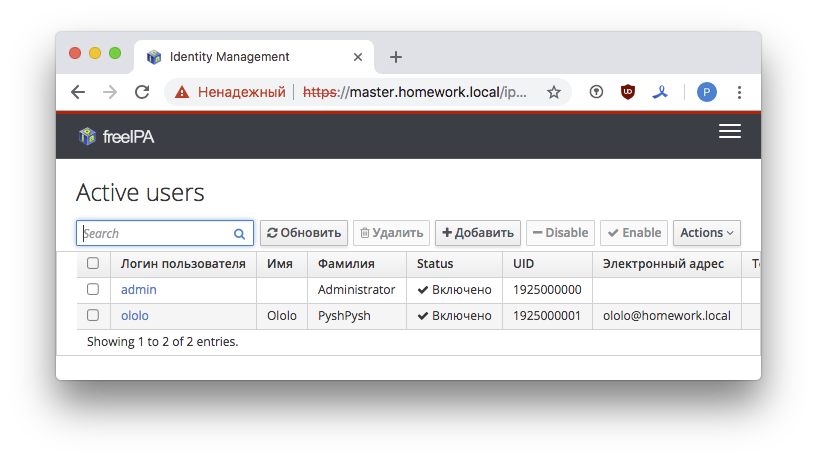
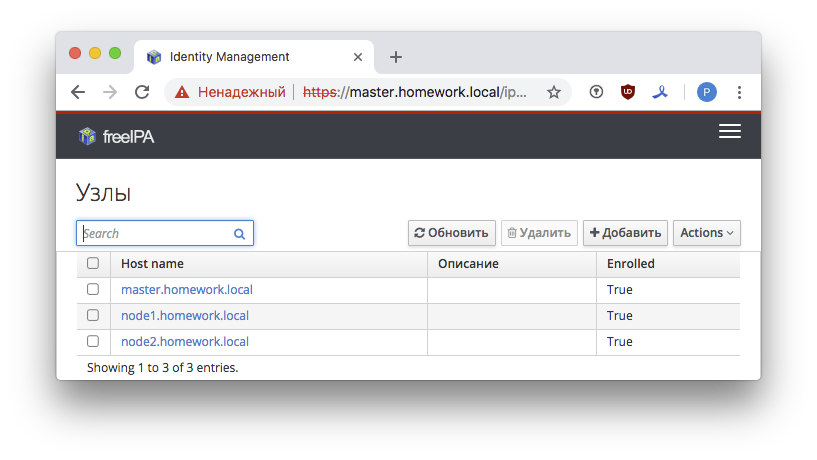

## LDAP

#### 1. Установить FreeIPA

Добавим на рабочей машине в `/etc/hosts` записи:

```
192.168.11.150 master.homework.local
192.168.11.151 node1.homework.local
192.168.11.152 node2.homework.local
```

для того, что бы мы могли обращаться к нашим виртуальным хостам по fqdn. Будем работать с тремя виртуальными машинами, на одну из которых установим IPA-сервер - `master.homework.local`, на две другие - `node1(2).homework.local` будет установлен IPA-клиент.

Создадим [ansible.cfg](ansible/ansible.cfg) и [hosts.txt](ansible/hosts.txt), внесем туда необходимые параметры.

Для удобства работы добавим локального пользователя и его ssh ключ во все виртуальные машины и дадим ему права суперпользователя. Сделаем это с помощью provision в `Vagrantfile` через Ansible - [add_local_user.yml](add_local_user.yml).


```
- name: Provision my keys
  hosts: all
  become: yes
  vars:
    localuser: "{{ lookup('ENV','USER') }}"
  tasks:
    - name: Create local user
    - name: Putting local authorized_key
    - name: Add local user to sudoers file
```

Для того, что бы поставить IPA-сервер и клиент с помощью Ansible, нам нужно запустить инсталляцию в "unattended" режиме. Из документации можно понять, что делается это так:

- для сервера
```bash
ipa-server-install -U -r HOMEWORK.LOCAL -n homework.local -p 12345678 -a 12345678 --hostname=master --ip-address=192.168.11.150 --setup-dns --auto-forwarders --no-reverse
```
- для клиента
```
ipa-client-install -U -p admin -w 12345678 --server=master.homework.local --ip-address=192.168.11.150 --domain=homework.local --realm=HOMEWORK.LOCAL --hostname=node1.homework.local --mkhomedir
```

Тут `HOMEWORK.LOCAL` - наш домен, `12345678` - пароль админа IPA-сервера. Установка сервера происходит совместно с установкой встроенного DNS-сервера `--setup-dns`. Установка клиентов происходит следом, в процессе установки клиенты подключаются к серверу.

Перед установкой необходимо произвести модификацию файлов `/etc/hosts` и на сервере и на клиентах. Добавить первой строку `192.168.11.150 master.homework.local master.homework.local` на сервере, и `192.168.11.151(2) node1(2).homework.local node1(2).homework.local` - на клиентах. В `/etc/resolv.conf` на сервере добавить `nameserver 10.0.2.3`, это наш локальный DNS.

##### 1.1 SSH-ключ

После установки сервера добавляем пользователя `ololo` и его ssh-ключь на сервер, включаем его в группу `admins` и даем ему право быть суперпользователем. Выглядит это в командной строке так:

```bash
ipa user-add ololo ... --sshpubkey="ssh-rsa"
ipa sudorule-add --cmdcat=all All
ipa sudorule-add-user --groups=admins All
```

##### 1.2 Ansible роль

Превращаем все команды в таски Ansible. Для установки сервера написана [роль](ansible/roles/deploy_ipa_server). Плейбук для установки сервера с добавлением пользователя `ololo` со всеми его привилегиями - [ipa-srv-role.yml](ansible/ipa-srv-role.yml).

Тестируем:

```bash
$ ssh ololo@node1.homework.local
Last login: Mon Dec  3 08:43:20 2018 from 192.168.11.1
[ololo@node1 ~]$ sudo -i
[sudo] password for ololo:
[root@node1 ~]#
```

Пользователь `ololo` попадает на сервер по ключу, имеет права суперпользователя.

#### 2. Написать playbook для конфигурации клиента

Плейбук для развертывания IPA-клиентов - [ipa-cli-role.yml](ansible/ipa-cli-role.yml). Написана [роль](ansible/roles/deploy_ipa_client).

#### 3. Всю "сетевую лабораторию" перевести на аутентификацию через LDAP

После деплоя сервера и клиентов вся аутентификация работает через IPA-сервер.

Красивые картинки:




#### 4. Настроить авторизацию по ssh-ключам

См. [часть 1.1](). Попутно написана [роль](ansible/roles/add_epel_repo) для установки epel репозитория. 

#### PS.

Можно настроить локальный DNS сервер с динамическим обновлением зоны, добавить Ansible Vault для хранения ssh ключей, еще несколько усовершенствований. Тестовые плейбуки без ролей: для [сервера](ansible/ipa_server_install.yml), для [клиента](ansible/ipa_clients_install.yml). Для каждой роли написан README.md файл, с описанием переменных и примером плейбука:
- [add_epel_repo](ansible/roles/add_epel_repo)
- [deploy_ipa_server](ansible/roles/deploy_ipa_server)
- [deploy_ipa_client](ansible/roles/deploy_ipa_client)