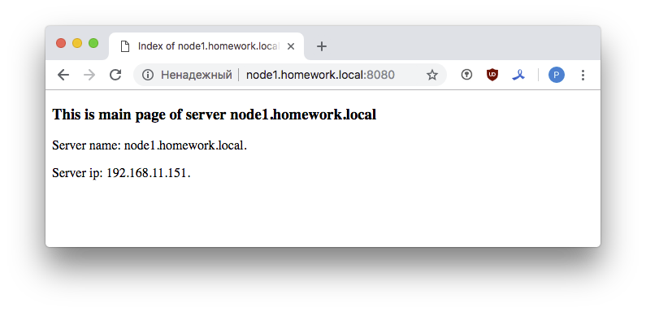
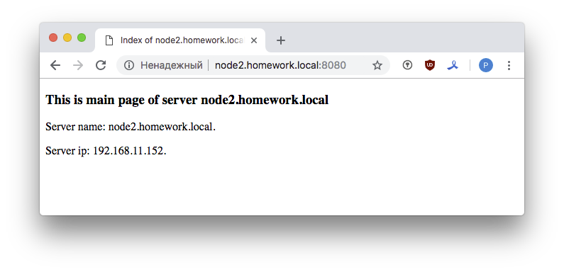
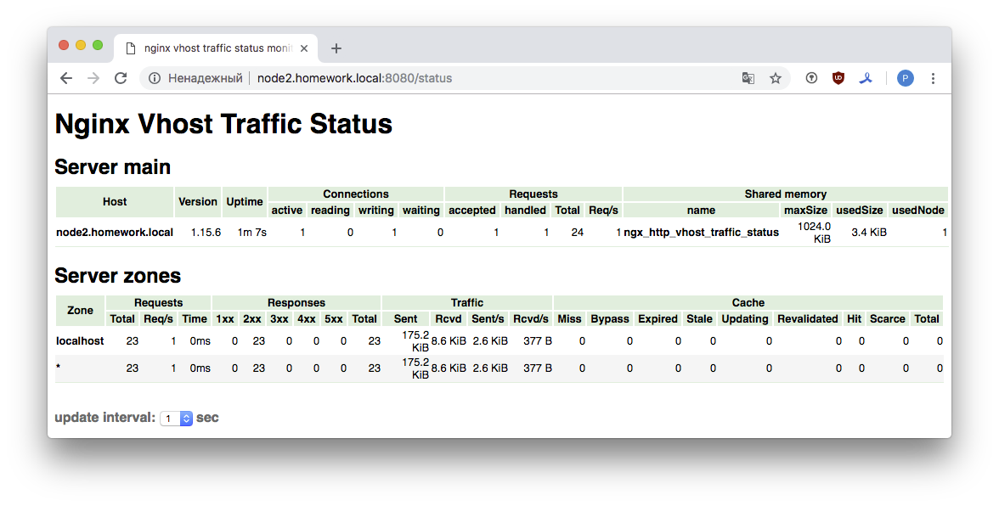

## Ansible

#### 1. Подготовить стенд на Vagrant как минимум с одним сервером. 

Стенд не претерпел изменений со времени [ДЗ №10](https://github.com/kakoka/otus-homework/tree/master/hw10). Будем работать с [Vagrantfile](https://github.com/kakoka/otus-homework/tree/master/hw10/Vagrantfile) из этого домашнего задания.

#### 2. Развернуть nginx

Будем разворачивать ранее собранный nginx с модулем статистики из локального репозитория. (см. [ДЗ №8](https://github.com/kakoka/otus-homework/tree/master/hw08)).

##### 2.1 Использовать модуль yum/apt.

Создадим роль для добавления репозитория - `add_local_repo`. Скопируем готовый файл с описанием локального репозитория - [`vts.repo`](roles/add_local_repo/files/vts.repo). Роль [add_local_repo](roles/add_local_repo). 

##### 2.2 Шаблоны jinja2 с перемененными.

Создадим роль для разворачивания nginx, с помощью которой развернем http сервер на серверах из [ДЗ №10](https://github.com/kakoka/otus-homework/tree/master/hw10) - `node1(2).homework.local`.
Роль [deploy_nginx_server](roles/deploy_nginx_server).

Добавим в `templates` файлы:

- nginx.conf.j2
- default.conf.j2
- index.html.j2

В `default/main.yml` опишем наши переменные.

##### 2.3 Nginx должен быть в режиме enabled в systemd.

Добавим в список [тасков](roles/deploy_nginx_server/tasks/main.yml) несколько пунктов:

```
# install and configure nginx service

- name: сopy systemd script
- name: сreate systemd symlink for nginx
- name: reload scripts systemd
- name: enable service nginx
```

для установки в сервиса nginx в systemd.     

##### 2.4 Notify для старта nginx после установки.

Добавим в `handlers/main.yml`

```
- name: Restart nginx
  service:
     name: nginx
     state: restarted
```

а в `tasks/main.yml` к нашим таскам

```
notify: Restart nginx
```

##### 2.5 Nginx должен слушать на нестандартном порту - 8080, использовать переменные в Ansible.

Переменные:

- nginx_port - порт http сервера - по условиям задания - 8080
- nginx_web_root - путь до директории web root, `/var/www/html/`
- nginx_conf_folder - путь до директории с конфигурацией nginx - `/etc/nginx`
- nginx_conf_def_folder - путь до директории с конфигурацией web сайта - `/etc/nginx/conf.d`

Переменные подставляются в шаблоны.

Традиционные скриншоты:

- http://node1.homework.local:8080

- http://node2.homework.local:8080

- http://node2.homework.local:8080/status - убеждаемся, что nginx взят из локального репозитория.


##### 2.6 Написать роль для nginx.

Написаны роли:

- [add_local_repo](roles/add_local_repo)
- [deploy_nginx_server](roles/deploy_nginx_server)

Серверы описаны в файле [hosts.txt](hosts.txt).
Плейбук: [deploy-nginx.yml](deploy-nginx.yml).
Запуск: `ansible-playbook deploy-nginx.yml`.