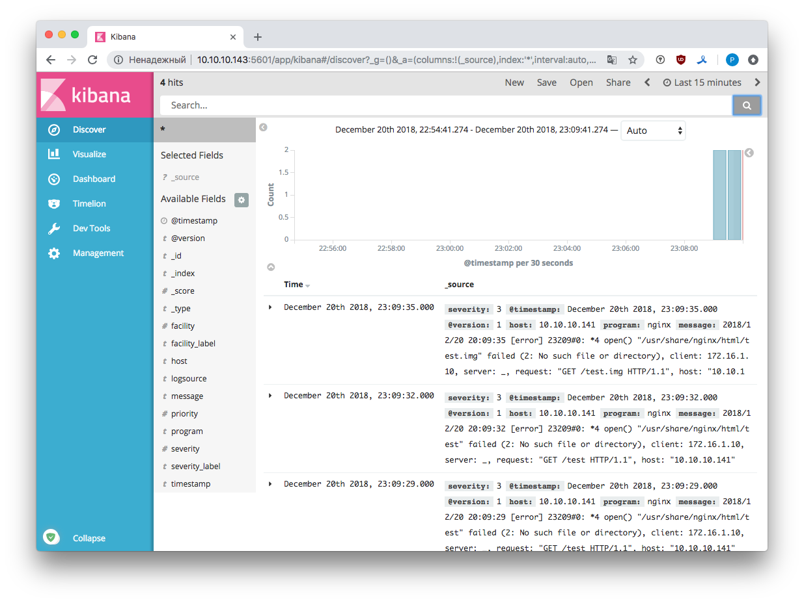

## Сбор и анализ логов. Rsyslog и ELK

#### 1. Настраиваем центральный сервер для сбора логов

Запускаем три вирутальные машины: **master**, **node1** и **node2**. Настраиваем центральный лог сервер на **master** и клиентов на **node1** и **node2**.

Будем собирать логи с помощью rsyslog. Для этого настроим прием сообщений syslog из вне. Изменим конфигурационный файл, включим несколько файлов для решения последующих задач.

1. Сервер будет слушать на порту 514 tcp/udp.

2. Добавим шаблоны для парсинга входящих сообщений в `rsyslog.conf`. `$template PerHostLog,"/var/log/remote-hosts/%HOSTNAME%/%programname%.log"`

3. Включим в конфиг файл, где описан прием логов со стороны nginx на node1 [srv-include-nginx.conf](roles/conf_rsyslog_server/templates/srv-include-nginx.conf.j2). `$IncludeConfig /etc/rsyslog.d/*.conf`. 

4. Написана соответствующая [роль](roles/conf_rsyslog_server).

#### 2. Логи аудита уходят _только_ на удаленную систему

Эту задачу решим двумя способами:

##### 2.1 Audit пересылает сообщения на центральный сервер audit.

Для этой цели написаны две роли. Настроим на master демон auditd для приема лога аудита с клиентов - [роль](roles/conf_audit_server). Демон слушает на tcp порту 60.

```
[master]$ lsof -i tcp:60
COMMAND   PID USER   FD   TYPE DEVICE SIZE/OFF NODE NAME
auditd  16746 root    4u  IPv6 661272      0t0  TCP syslog_host:60->node1.homework.local:41676 (ESTABLISHED)
auditd  16746 root   11u  IPv6 656151      0t0  TCP *:60 (LISTEN)
``` 

На **node1** настроен демон auditd который пересылает логи на **master**. Все сообщения аудита сохраняются на **master** в `/var/log/audit/audit.log`. Для клиента написана [роль](roles/conf_audit_client).

```
[node1]$ lsof -i tcp:60
COMMAND     PID USER   FD   TYPE    DEVICE SIZE/OFF NODE NAME
audisp-re 22724 root    4u  IPv4 539458832      0t0  TCP node1.homework.local:41676->master.homework.local:60 (ESTABLISHED)
```

При этом логи на **node1** не сохраняются локально (кроме случая, когда переполняется очередь в следствие проблем, к примеру, сети). 

##### 2.2 Audit пересылает сообщения в локальный syslog, оттуда на сервер сбора логов. 

В этом случае на **node1** настраиваем auditd, который пересылает логи локальному rsyslog. Присваиваем таким сообщениям `facility=local6`. 

Cообщения с таким значением rsyslog не записывает в локальный журнал (1), а тут же пересылает на центральный сервер сбора логов (2) `local6.none /var/log/messages`(1) `local6.* @master:514`(2). Так же на клиенте необходимо установить `audit-libs`, `audispd-plugins`. Написана соответствующая [роль](roles/conf_auidit_client_syslog).

```
$ lsof -i tcp:514
COMMAND    PID USER   FD   TYPE    DEVICE SIZE/OFF NODE NAME
rsyslogd 23078 root   17u  IPv4 539461411      0t0  TCP node1.homework.local:41504->master.homework.local:shell (ESTABLISHED)
rsyslogd 23078 root   18u  IPv4 539461412      0t0  TCP node1.homework.local:41506->master.homework.local:shell (ESTABLISHED)
```

#### 3. Следим за изменением конфигов nginx 

Для того, что бы следить за изменением файла `/etc/nginx/nginx.conf`, необходимо задать соответствующее правило аудита. Добавим в `/etc/audit/rules.d/audit.rules` строчки:

-  `-w /etc/nginx/nginx.conf -p wa -k nginx`.
-  `-w /etc/nginx/conf.d/default -p wa -k nginx`.

Проверяем:

```
node=node1.homework.local type=CONFIG_CHANGE msg=audit(1545302831.317:179224725): auid=1001 ses=195 op=updated_rules path="/etc/nginx/nginx.conf" key=(null) list=4 res=1
```

#### 4. Все критичные логи с web должны собираться и локально и удаленно

Добавим в rsyslog.conf на **node1** и **node2** строчки:

- *.=crit /var/log/critical.log
- *.=crit @master:514


#### 5. Все логи с nginx должны уходить на удаленный сервер (локально только критичные)

Syslog следит за лог-файлами nginx в `/var/log/nginx` и пересылает логи на центральный сервер согласно приоритету.

```
$template error, "<163> %msg%"
$template access, "<166> %msg%"
```

Для слежения и пересылки логов написана роль `conf_rsyslog_client` - [соответствующий шаблон](roles/conf_rsyslog_client/templates/client-include-nginx.conf.j2).

#### 6. Развернуть ELK

Добавим еще одну ВМ - **master_elk**. Воспользуемся помощью всемирного разума :-], поищем готовый стек ELK в докере. Таковой нашелся, да и еще с готовым коллектором syslog, который слушает на tcp/5140. Развернем готовый стек:

```
$ git clone https://github.com/yangjunsss/docker-elk-syslog
$ docker-compose up --build
```

В elk должны уходить только логи nginx. Подкрутим конфиг nginx:

```
error_log syslog:server=master_elk:5140,facility=local7,tag=nginx,severity=error;
access_log syslog:server=master_elk:5140,facility=local7,tag=nginx,severity=info main;
```



#### 7. Итого

Таким образом у нас на **master** syslog принимает сообщения с **node1** и **node2**: 

- принимаем логи всего, что описано на node1,2 в rsyslog.conf
- принимаем логи аудита, без сохранения их локально
- принимаем логи nginx

При добавлении **master_elk**: 

- перенаправляем на него логи nginx

#### 8. Ссылки

- [Аудит системных событий в Linux](https://habr.com/company/selectel/blog/267833/)

- [Configure Linux OS to send audit logs to QRadar®.](https://www.ibm.com/support/knowledgecenter/en/SS42VS_DSM/t_DSM_guide_Linux_OS_auditlogs.html)

- [Audit  remote server](https://www.server-world.info/en/note?os=CentOS_7&p=audit&f=2)

- [Auditd : Output Logs to Remote Host](https://luppeng.wordpress.com/2016/08/06/setting-up-centralized-logging-with-auditd/)

- [How to Setup Rsyslog Client to Send Logs to Rsyslog Server in CentOS 7](https://www.tecmint.com/setup-rsyslog-client-to-send-logs-to-rsyslog-server-in-centos-7/)

- [RFC 5424 — Протокол Syslog. PRI (приоритет)](https://rfc2.ru/5424.rfc/8#p6.2.1)