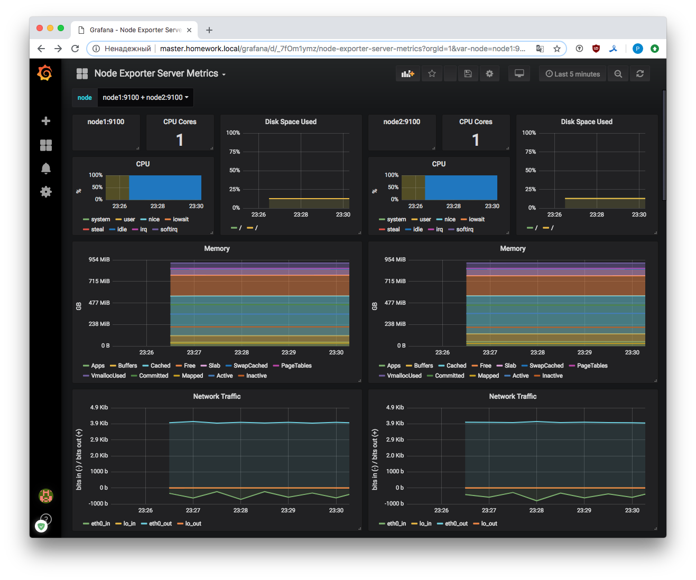
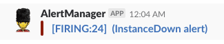
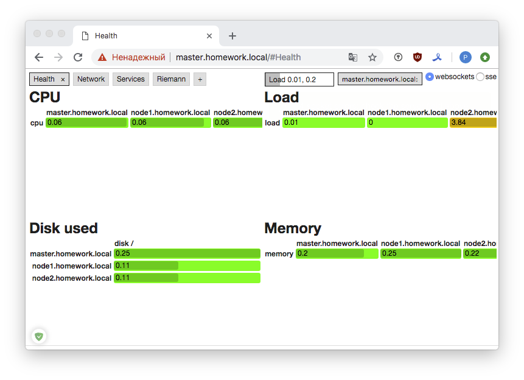
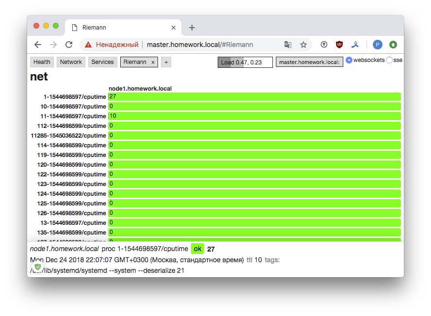

## Системы мониторинга. Prometheus. Grafana.

#### 1. Настроить дашборд с четыремя графиками: память, процессор, диск, сеть

Используем для мониторинга `prometheus` и `grafana`. На **master** разворачиваем prometheus, grafana и nginx. Последний будет работать в режиме reverse proxy. На **node1** и **node2** - разворачиваем `node_exporter` для сбора метрик с целевых систем.

Написаны следующие роли:

- для развертывания [prometheus](roles/add_prometheus)
- для развертывания [grafana](roles/add_grafana)
- для развертывания [node_exporter](roles/add_node_exporter)
- для развертывания [nginx](roles/add_nginx_server) в качестве reverse proxy

Настроенный dashboard:



Prometheus (`master`) собирает подготовленные метрики с `node1` и `node2`. Так же настроены [alert rules](roles/add_prometheus/templates/alert.rules.j2). Можно еще развернуть alertmanager, в конфигурацию которого добавить следующее:

```
receivers:
- name: slack
  slack_configs:
  - api_url: https://hooks.slack.com/services/APIURLSECRET
    channel: '#alerts'
```

Таким образом мы будем получать уведомления о проблемах в канал `#alerts` в корпоративный Slack. Эти сообщения можно [кастомизировать](https://harthoover.com/pretty-alertmanager-alerts-in-slack/), добавить необходимые шаблоны.



#### 2. Система мониторинга Riemann

Попытка следовать дополнительному заданию (использовать системы, примеры которых не рассматривались на занятии), привела к системе [Riemann](http://riemann.io/). Названа она, видимо, в честь немецкого математика [Бернхарда Римана](https://ru.wikipedia.org/wiki/%D0%A0%D0%B8%D0%BC%D0%B0%D0%BD,_%D0%91%D0%B5%D1%80%D0%BD%D1%85%D0%B0%D1%80%D0%B4). Кстати, пишут, что это штука изобретена именно для highload.

Система написана на Ruby, Java и Clojure :), что уже не банально. 

Для того, что бы мониторинг заработал, необходимо поставить:

- сервер
	- инструменты разработчика
	- java
	- ruby
	- nginx (или apache)
	- riemann, riemann-client riemann-tools riemann-dash
- клиент
	- инструменты разработчика
	- ruby
	- riemann-tools

В сети есть [описания](https://medium.com/ovni/riemann-io-a113478d7705), как все это [ставится](https://www.kartar.net/2014/12/an-introduction-to-riemann/) и [запускается](https://habr.com/company/selectel/blog/281651/), достаточно понятно, правда не всегда то, что описано работает, но в общем завелось.

Концепт системы такой:

- событие - базовое понятние;
- события можно обрабатывать, собирать и экспортировать;
- потоки - функции, в которые могут быть направлены события;
- потоков может быть неограниченное количество;
- индексы - таблицы отслеживания актуальности событий;
- в индексах события могут быть отсортированы;
- каждое событие имеет ограниченное время жизни;
- к индексам можно обращаться откуда угодно.

Выглядят события так (кусочек лога `/var/log/riemann/riemann.log`):

```
INFO [2018-12-24 19:04:11,105] defaultEventExecutorGroup-2-1 - riemann.config - #riemann.codec.Event{:host node1.homework.local, :service disk /, :state ok, :description 11% used, :metric 0.11, :tags nil, :time 1545678251, :ttl 10.0}

INFO [2018-12-24 19:04:11,107] defaultEventExecutorGroup-2-1 - riemann.config - #riemann.codec.Event{:host node1.homework.local, :service load, :state ok, :description 1-minute load average/core is 0.0, :metric 0.0, :tags nil, :time 1545678251, :ttl 10.0}

INFO [2018-12-24 19:04:11,163] defaultEventExecutorGroup-2-1 - riemann.config - #riemann.codec.Event{:host node2.homework.local, :service cpu, :state ok, :description 6.61% user+nice+system

 0.1 61311 ruby
%CPU   PID COMMAND
 0.0     9 rcu_sched
 0.0  9509 sshd
 0.0    91 kauditd
 0.0     8 rcu_bh
 0.0     7 migration/0
 0.0   715 qmgr
 0.0   713 master
 0.0   631 tuned, :metric 0.06613226452905811, :tags [node-two], :time 1545678251, :ttl 10.0}
```

Рассмотрим подробнее:

```
{:host node1.homework.local, :service disk /, :state ok, :description 11% used, :metric 0.11, :tags nil, :time 1545678251, :ttl 10.0}
```

* host - имя хоста
* service - имя сервиса
* state - состояние события (аналог Severity в syslog)
* description - описание
* metric - метрика
* tags - произвольный тэг
* time - время
* ttl - время актуальности

Собственно, этот список может быть расширен и углублен. 

Конфигурационный файл сервера - [riemann.conf](Reimann/riemann.conf):

Указываем где серверу слушать:

```
; Listen on the local interface over TCP (5555), UDP (5555), and websockets
; (5556)
(let [host "0.0.0.0"]
  (tcp-server {:host host})
  (udp-server {:host host})
  (ws-server  {:host host}))
``` 

и заносим, все, что прилетает в поток:

```
(let [index (index)]
  ; Inbound events will be passed to these streams:
  (streams

    (default :ttl 60
      ; Index all events immediately.
      index
	prn
	#(info %))
    )
```

Далее, на ходу в потоке (stream) мы можем делать всякие манипуляции, например, следить за метрикой LA:

```
(where (and (service "load") (> metric 0.50))
(info "ALERT! LA is over 50%!" %)
```

Здесь же мы можем сконфигурировать уведомления и прочие опции. 

На клиентах (node1 и node2) запустим riemann-health (модуль только для базовых метрик), riemann-proc, riemann-disk, riemann-net [и там их еще есть](https://github.com/riemann/riemann-tools) с ключом `--host master.homework.local` (укажем сервер). Можно запустить эти инструменты в фоне, написав юниты systemd.

Наблюдаем записи в логе (`/var/log/riemann/riemann.log`). Далее, на сервере настроим riemann-dashboard для отображения метрик, nginx в качестве reverse proxy. Пример конфига riemann-dashboard [тут](dash/), [nginx](Reimann/default.conf).





Собственно, картина, [отличная](http://riemann.io/dashboard.html), конечно, от скриншотов на сайте самого инструмента для мониторинга. Ну, чуднАя штука :)


Если сильно заморочится, то можно обрести счастье с этой системой, потому как она гибкая, быстрая и достаточно удобная (если разобраться, конечно).

#### 3. Ссылки

[Using external URLs and proxies with Prometheus](https://www.robustperception.io/using-external-urls-and-proxies-with-prometheus)

[Pretty AlertManager Alerts in Slack](https://harthoover.com/pretty-alertmanager-alerts-in-slack/)

[Grafana Documentation](http://docs.grafana.org/)