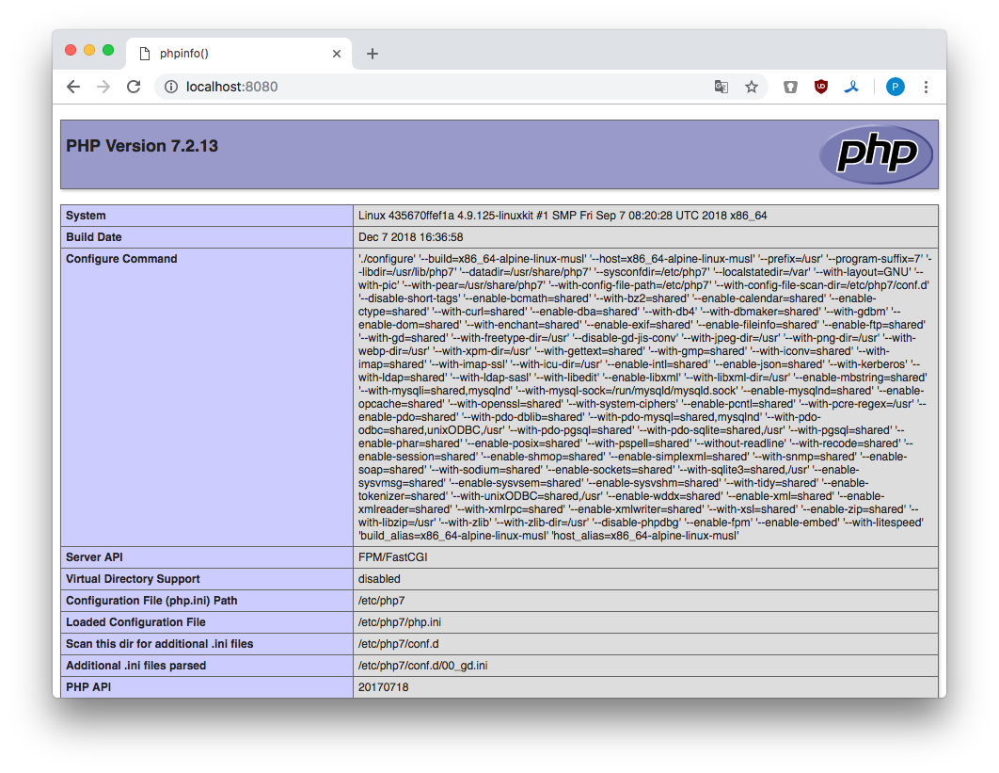

## Docker

#### 1. Docker

##### 1.1 Создать кастомный образ nginx на базе alpine.

Создадим [Dockerfile](docker/nginx/Dockerfile) для nginx, запустим сборку образа:

```
docker build -t kakoka/nginx --no-cache .
```

В файлах [nginx.conf](docker/nginx/nginx.conf) и [default.conf](docker/nginx/default.conf) находится минимально необходимый конфиг для старта nginx.

##### 1.2 После запуска nginx должен отдавать кастомную страницу.

Запускаем контейнер и проверяем:

```
docker run -d -p 8080:8080 --name nginx kakoka/nginx
```

```
$ curl -I http://localhost:8080

HTTP/1.1 200 OK
Server: nginx/1.14.2
Date: Tue, 15 Jan 2019 10:18:22 GMT
Content-Type: text/html
Content-Length: 33
Last-Modified: Tue, 15 Jan 2019 09:48:39 GMT
Connection: keep-alive
ETag: "5c3dac77-21"
Accept-Ranges: bytes

$ curl http://localhost:8080

New NGINX instance inside Docker
```

##### 1.3 Собранный образ необходимо запушить в docker hub и дать ссылку на репозиторий.

```
$ docker login
$ docker push kakoka/nginx
```

[Репозиторий на Docker Hub](https://hub.docker.com/r/kakoka/nginx)
или `docker pull kakoka/nginx`

##### 1.4 Вопросы.

- Можно ли в контейнере собрать ядро?

Теоретически, ядро собрать можно: необходимо описать сборку образа для сборки ядра:

1. установить необходимые пакеты (например `yum groupinstall "Development Tools"`) для сборки
2. скопировать исходные тексты ядра
3. описать команду для сборки ядра

После, запустить образ и посмотреть как поведет себя контейнер. Практически не пробовал :] такое делать.

- Определить разницу между контейнером и образом.

Образ это инертный, неизменный файл, который по сути является снимком контейнера. Образ можно создать командой build. Образ можно запустить, когда он запускается, то создается контейнер. Образы хранятся в реестре образов (как локально, так и на внешних ресурсах). 

#### 2. Docker-compose

##### 2.1 Создать кастомные образы nginx и php.

Кастомный образ nginx был создан в [п. 1.1](#) и выложен в Docker Hub.

Кастомный образ php будем создавать на основе php-fpm - менеджера процессов PHP Fast CGI. См. [Dockerfile](docker/php/Dockerfile).

Собираем образ и пушим на Docker Hub: 

```
$ docker build kakoka/fpm --no-cache .
$ docker push kakoka/fpm
```

##### 2.2 Объединить nginx и php в docker-compose. 

Сам файл [Docker-compose.yml](docker-compose/docker-compose.yml), к нему необходимо дописать пару конфигурационных файлов:

- [defaul-php.conf](docker-compose/defaul-php.conf) конфигурация nginx для работы с php,
- [index.php](docker-compose/code/index.php) - файл с командой вывода php-info.

Стартуем контейнеры:

```
$ docker-compose up -d
```

##### 2.3 После запуска nginx должен показывать php-info. 



##### 2.4 Все собранные образы должны быть в docker hub.

Все образы находятся в Docker Hub
- [https://hub.docker.com/r/kakoka/nginx](https://hub.docker.com/r/kakoka/nginx)
- [https://hub.docker.com/r/kakoka/fpm](https://hub.docker.com/r/kakoka/fpm)

Или `docker pull kakoka/fpm` и `docker pull kakoka/fpm`.
