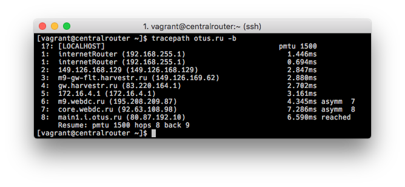
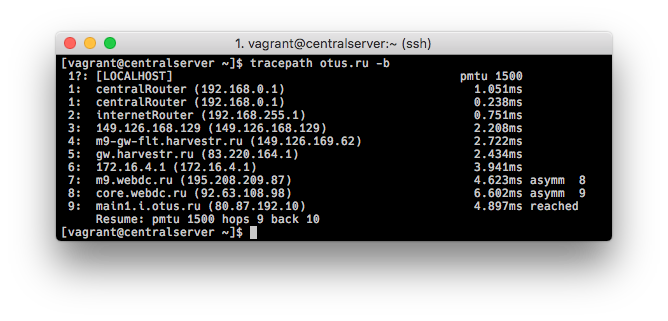
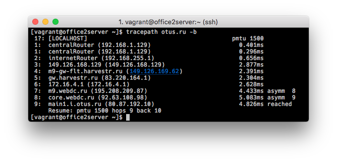
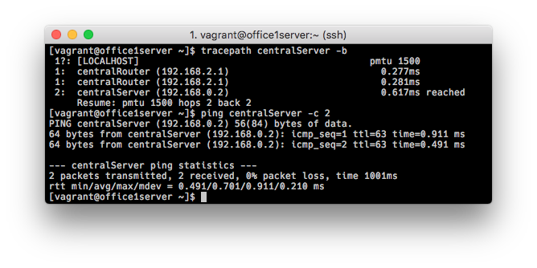
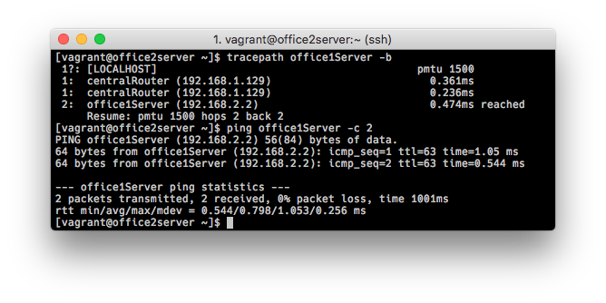

## Архитектура сетей

### 1. Теоретическая часть

#### 1.1 Найти свободные подсети.

|Подсеть|Min IP|Max IP|Broadcast|Hosts|Mask|
|---|---|---|---|:---:|---|
|192.168.0.16/28|192.168.0.17|192.168.0.30|192.168.0.31|14|255.255.255.240|
|192.168.0.48/28|192.168.0.49|192.168.0.62|192.168.0.63|14|255.255.255.240|
|192.168.0.128/25|192.168.0.129|192.168.0.254|192.168.0.254|126|255.255.255.128|

#### 1.2 Посчитать сколько узлов в каждой подсети, включая свободные.

##### Office1

|Название|Подсеть|Broadcast|Hosts|Mask|
|---|---|---|:---:|---|
|dev|192.168.2.0/26|192.168.2.63|62|255.255.255.192|
|test servers|192.168.2.64/26|192.168.2.127|62|255.255.255.192|
|managers|192.168.2.128/26|192.168.2.191|62|255.255.255.192|
|office hardware|192.168.2.192/26|192.168.2.255|62|255.255.255.192|

##### Office2

|Название|Подсеть|Broadcast|Hosts|Mask|
|---|---|---|:---:|---|
|dev|192.168.1.0/25|192.168.1.127|126|255.255.255.128|
|test servers|192.168.1.128/26|192.168.1.191|62|255.255.255.192|
|office hardware|192.168.1.192/26|192.168.1.255|62|255.255.255.192|


##### Central

|Название|Подсеть|Broadcast|Hosts|Mask|
|---|---|---|:---:|---|
|directors|192.168.0.0/28|192.168.0.15|14|255.255.255.240|
|office hardware|192.168.0.32/28|192.168.0.47|14|255.255.255.240|
|wifi|192.168.0.64/26|192.168.0.127|62|255.255.255.192|


#### 1.3 Указать broadcast адрес для каждой подсети.

Broadcast адреса указаны в таблицах выше. Ошибки при разбиении не обнаружил.

### 2. Практическая часть

Немного расширим исходную схему:

```sequence
  Office1 → office2-net ⤵
(4 subnets)  (switch)     CentralRouter → router-net → InternetRouter ⇨ internet
                                 ↑         (switch)
  Office2 → office2-net ⤴  central-net  
(3 subnets)  (switch)        (switch)    
                                 ↑
                           CentralOffice
                            (3 subnets)
```


#### 2.1 Соединить офисы в сеть согласно схеме и настроить роутинг.

##### 2.1.1 Internet Router

InetRouter - внешний интерфейс (eth0) получает ip-адрес по DHCP, на внутренний интерфейс (eth1) назначаем ip-адрес 192.168.255.1/255.255.255.252. Включаем NAT на eth0 и создаем статический маршрут: 

```
iptables -t nat -A POSTROUTING ! -d 192.168.0.0/16 -o eth0 -j MASQUERADE
ip route add 192.168.0.0/16 via 192.168.255.2
```

Так же в `/etc/sysctl.conf` добавляем опции ядра, которые разрешают нам форвардинг пакетов:

```
echo "net.ipv4.ip_forward=1" >> /etc/sysctl.conf
sysctl -p /etc/sysctl.conf
```

##### 2.1.2 Виртуальные сети (switches)

Создадим виртуальные свитчи:

- router-net - к нему подключены внутренний интерфейс inetRouter (eth1) и внешний интерфейс centralRouter (eth1)
- central-net - к нему подключена сеть центрального офиса
- office1-net - к нему подключена сеть офиса 1
- office2-net - к нему подключена сеть офиса 2

##### 2.1.3 Сentral Router

На centralRouter создаем 4 сетевых интерфейса и назначим им ip-адреса:

- eth1 - 192.168.255.2/255.255.255.252, подключен к router-net
- eth2 - 192.168.0.1/255.255.255.240, подключен к central-net
- eth3 - 192.168.1.1/255.255.255.128, подключен к office2-net
- eth4 - 192.168.2.1/255.255.255.192, подключен к office1-net

Так же на centralRouter на интерфейсы eth2,3,4 добавим дополнительные ip-адреса:

Подсети центрального офиса:
- eth2:0 192.168.0.33/255.255.255.240
- eth2:1 192.168.0.65/255.255.255.192

Подсети офиса 1:
- eth3:0 192.168.2.65/255.255.255.192
- eth3:1 192.168.2.129/255.255.255.192
- eth3:2 192.168.2.193/255.255.255.192

Подсети офиса 2:
- eth4:0 192.168.1.129/255.255.255.192
- eth4:1 192.168.1.193/255.255.255.192

и добавляем в sysctl.conf опции для форвардинга пакетов.

#### 2.2 Все сервера и роутеры должны ходить в интернет через inetRouter.

Проверяем, ходят ли все сервера и роутеры в интернет - `tracepath otus.ru -b`:

- internetRouter ⇨ internet


- centralRouter ⇨ internetRouter ⇨ internet



- centralServer ⇨ centralRouter ⇨ internetRouter ⇨ internet



- office1Server ⇨ centralRouter ⇨ internetRouter ⇨ internet


- office2Server ⇨ centralRouter ⇨ internetRouter ⇨ internet



#### 2.3 Все сервера должны видеть друг друга.

Проверяем видимость - `tracepath $servername -b` и `ping $servername -c 2`:

- centralServer ⇨ centralRouter ⇨ office1Server

- centralServer ⇨ centralRouter ⇨ office1Server

- office1Server ⇨ centralRouter ⇨ centralServer

- office1Server ⇨ centralRouter ⇨ office2Server

- office2Server ⇨ centralRouter ⇨ centralServer

- office2Server ⇨ centralRouter ⇨ office1Server


#### 2.4 У всех серверов отключить дефолтный маршрут через eth0, который Vagrant поднимает для связи.

Отключаем дефолтный маршрут командной:

```
echo "DEFROUTE=no" >> /etc/sysconfig/network-scripts/ifcfg-eth0 
```

Добавляем необходимый нам gateway исходя из конфигурации наших сетей (например, office1Server):

```
echo "GATEWAY=192.168.2.1" >> /etc/sysconfig/network-scripts/ifcfg-eth1
```

Попутно, для удобства, внесем изменения в /etc/resolv.conf - добавим локальный DNS-сервер и в /etc/hosts внесем записи, в зависимости от сервера:

```
192.168.255.1 internetRouter
192.168.1.129 centralRouter
192.168.0.2 centralServer
192.168.2.2 office1Server
192.168.1.130 office2Server
```
Таблица маршрутов на centralRouter:


#### 2.5 При нехватке сетевых интерфейсов, добавить по несколько адресов на интерфейс.

Добавлены несколько сетевых адресов на интерфейс, см. в п. 2.1. Отметим, что более оптимальный способ организации такого рода сети - разбиение на VLANы. 

Все описанные выше настройки внесены в [Vagrantfile](Vagrantfile).
##### PS.

По какой-то неясной причине `systemctl restart network` не отрабатывает через provision в Vagrant. Это относится как к shell, так и ansible. Приходится заходить на каждую виртуалку (через SSH) и руками перезапускать network, после чего устанавливаются корректные гейты и маршруты.

- [NMCli config guide from cisco](https://www.cisco.com/c/en/us/td/docs/net_mgmt/prime/network_registrar/9-1/installation/guide/Install_Guide/Install_Guide_9_1_appendix_01101.pdf)
- [Fedora docs](https://docs.fedoraproject.org/en-US/Fedora/23/html/Networking_Guide/sec-Using_the_Command_Line_Interface.html)
- [RHEL tutorial - ip forwarding] (https://rhel7tutorial.wordpress.com/how-to-enable-ip-forwarding/)
- [Restarting network interfaces in Ansible](https://earlruby.org/2015/04/restarting-network-interfaces-in-ansible/)
- [How to Configure and Manage Network Connections Using ‘nmcli’ Tool](https://www.tecmint.com/configure-network-connections-using-nmcli-tool-in-linux/)
- [Add a Static Route on CentOS](https://my.esecuredata.com/index.php?/knowledgebase/article/2/add-a-static-route-on-centos)
- [Configuring firewalld to act as a router](https://www.centos.org/forums/viewtopic.php?t=53819)

##### PPS1.

When you update a connection that is currently active, eg via
    `nmcli connection load "$IFCFG_NAME"`
    `nmcli connection reload`
or
    `nmcli connection modify "$CON"`
These commands only modify the connection profile. The changes do not take effect immediately on already activated devices. That is intentional.
Note the distinction between
  - connection (profile)
  - actual device (networking interface)


If you want to apply the changed connection, you need do one of:

  # reactivate connection, implicitly doing a down+up
  nmcli connection up "$CON"   

  # reconnect the device, doing a down+up.
  nmcli device connect $DEV

  # legacy initscripts invoke `nmcli connection up`
  ifup $NAME

  # a more graceful way is reapply, which doesn't do a full down+up cycle and 
  # you don't loose connectivey:
  nmcli device reapply $DEV


On the other hand, if you add a connection (or modify a connection that is currently not active), the connection might start autoconnecting right away, depending on it's connection.autoconnect setting. That leads to a confusing situation that:

  nmcli connection add type ethernet con-name T iface '*'
  # at this point, the new connection might already activate on the device
  # with incomplete configuration.
  nmcli connection modify T ipv4.dns 8.8.8.8

The solutions for that are:
  # do all in one step:
  nmcli connection add type ethernet con-name T iface '*' ipv4.dns 8.8.8.8

  # after the last modification, re-activate the connection, see before.
  nmcli connection modify T ipv4.dns 8.8.8.8
  nmcli connection up T

  # don't use autoconnect initially.
  nmcli connection add type ethernet con-name T iface '*' autoconnect no
  nmcli connection modify T ipv4.dns 8.8.8.8 connection.autoconnect yes

##### PPS2.  

NM automatically sets the default route based on two things:

(1) interface priority - all interfaces have a priority and if two
interfaces are active, and *not* prevented from getting the default
route (see #2), the one with the highest priority wins.  Right now,
that's a static ordering but we're exploring how to make that dynamic.

(2) the "never-default" option: you can prevent connections (and thus
their interface when that connection is active) from ever getting the
default route by setting this option.  With nmcli:

nmcli c mod eth0 ipv4.never-default true
nmcli c mod eth0 ipv6.never-default true

would prevent connection "eth0" from ever receiving the IPv4 or IPv6
default route.  This would allow some other connection/interface to
receive the default route, when active.