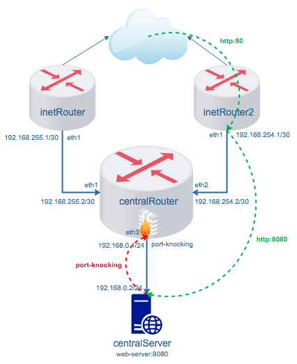
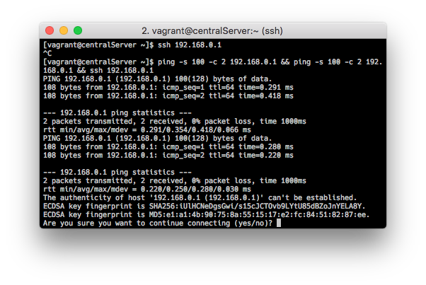
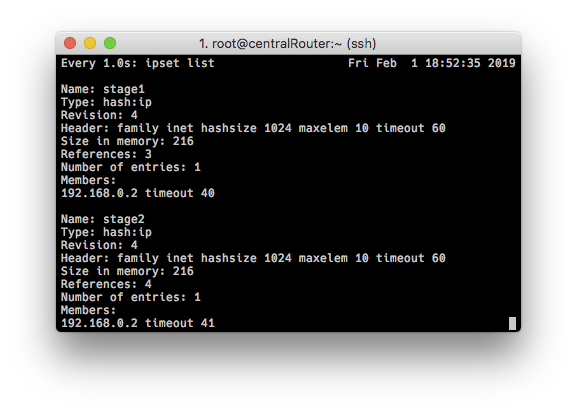

## Iptables, NAT, Firewalld



Сеть состоит из `inetRouter`, `inetRouter2`, подключенных интерфейсами `eth0` к интернет, интерфейсами `eth1` к соответствующим интерфейсам `centralRouter` (`eth1`, `eth2`). `centralServer` подключен к интерфейсу `eth3` `centralRouter`.

|Подсети|Устройство|Интерфейс - ip|Устройство|Интерфейс - ip|
|---|---|---|---|---|
|192.168.255.1/30|inetRouter|eth1 192.168.255.1/30|centralRouter|eth1 192.168.255.2|
|192.168.254.1/30|inetRouter2|eth1 192.168.254.1/30|centralRouter|eth2 192.168.254.2|
|192.168.0.1/24|centralRouter|eth3 192.168.0.1/24|centralServer|eth1 192.168.0.2/24|

Для настройки будем использовать `firewalld`. На `inetRouter`, `inetRouter2`,  `centralRouter` включен NAT:

```
firewall-cmd --zone=public --add-masquerade --permanent
```

На `centralServer` установлен маршрут в интернет только через `inetRouter`:

```
ip route add default nexthop via 192.168.255.1 weight 1
``` 

Можно организовать multipath routing, добавив такой маршрут (в [Vagrantfile](Vagrantfile) он закомментирован):

```
ip route add default
	nexthop via 192.168.255.1 weight 1
	nexthop via 192.168.254.1 weight 2
```

На `centralServer` работает nginx на порту 8080.

### 1. Проброс портов

Траффик, который приходит на интерфейс `eth1` `inetRouter2` на порт 80 пробросить на порт 8080 `centralServer`. В firewalld это делается одной командой:

```
firewall-cmd --zone=public \
--add-forward-port=port=80:proto=tcp:toport=8080:toaddr=192.168.0.2 \
--permanent
```

Тестируем:

<pre>
[vagrant@centralServer ~]$ curl -I 192.168.254.1
HTTP/1.1 200 OK
Server: nginx/1.12.2
Date: Thu, 31 Jan 2019 13:29:58 GMT
Content-Type: text/html
Content-Length: 3700
Last-Modified: Tue, 06 Mar 2018 09:26:21 GMT
Connection: keep-alive
ETag: "5a9e5ebd-e74"
Accept-Ranges: bytes
</pre>

<pre>
[vagrant@centralServer ~]$ curl -I 192.168.0.2
curl: (7) Failed connect to 192.168.0.2:80; Connection refused

[vagrant@centralServer ~]$ curl -I 192.168.0.2:8080
HTTP/1.1 200 OK
Server: nginx/1.12.2
Date: Thu, 31 Jan 2019 13:30:46 GMT
Content-Type: text/html
Content-Length: 3700
Last-Modified: Tue, 06 Mar 2018 09:26:21 GMT
Connection: keep-alive
ETag: "5a9e5ebd-e74"
Accept-Ranges: bytes
</pre>

<pre>
[vagrant@centralServer ~]$ sudo tail /var/log/nginx/access.log
192.168.254.1 - - [31/Jan/2019:13:29:58 +0000] "HEAD / HTTP/1.1" 200 0 "-" "curl/7.29.0" "-"
192.168.0.2 - - [31/Jan/2019:13:30:46 +0000] "HEAD / HTTP/1.1" 200 0 "-" "curl/7.29.0" "-"
</pre>


### 2. Bastion хост

Реализовывать механизм knocking port будем на интерфейсе `eth3` `centralRouter`. Будем использовать только те инструменты, которые присутствуют повсеместно, что бы не умножать сущности. Возьмем, например, команду `ping` (почему бы и нет;) и с помощью нее будем стучаться с `centralServer` "дважды по дважды" на интерфейс `eth3` `centralServer` с адресом `192.168.0.1` icmp пакетом длинной в 100 байт. 

Заметим, что стандартный заголовок ICMP пакета для echo-request - 28 байт. Делаем несколько правил, учитывающих эту особенность, будем отслеживать пакеты длиной 128 байт.

Заведем два ipset - stage1, stage2, оба с опцией timeout=60. Попадающие в них адреса будут находится в обоих списках только 60 секунд. 

Логика действий такова: если на eth3 приходит icmp пакет длиной в 100 байт, мы заносим адрес отправителя в stage1, если приходит повторный icmp пакет на eth3, и адрес отправителя находится в stage1, то мы заносим адрес отправителя в stage2. Разрешаем соединения на 22 порт всем ip адресам, которые временно находятся в stage2. Что бы не разрывалось установленное соединение по ssh, разрешим все установленные соединения. Пакет проходит обработку правилами до первого срабатывания, после срабатывания обработка пакета в цепочке завершается, поэтому важен порядок правил. 

Итак, правила в порядке следования:

Разрешим все установленные соединения:

```
firewall-cmd --permanent --direct \
--add-rule ipv4 filter INPUT 0 -i eth3 \
-m state --state ESTABLISHED,RELATED -j ACCEPT
```

Разрешим соединение на 22 порт только с тех ip адресов, которые находятся в ipset `stage2`:

```
firewall-cmd --permanent --direct \
--add-rule ipv4 filter INPUT 1 -i eth3 \
-m state --state NEW \
-m tcp -p tcp --dport 22 \
-m set --match-set stage2 src \
-j ACCEPT
```

Если первое правило сработало, но адрес уже в `stage1`, то заносим адрес источника в `stage2`:

```
firewall-cmd --permanent --direct \
--add-rule ipv4 filter INPUT 2 -i eth3 \
-p icmp -m icmp --icmp-type 8 \
-m length --length 128 \
-m set --match-set stage1 src \
-m set ! --match-set stage2 src \
-j SET --add-set stage2 src
```

Проверяем `icmp` пакеты на их длину, если правило сработало первый раз, заносим адрес источника пакетов в список `stage1`:

```
firewall-cmd --permanent --direct \
--add-rule ipv4 filter INPUT 3 -i eth3 \
-p icmp -m icmp --icmp-type 8 \
-m length --length 128  \
-m set ! --match-set stage1 src \
-m set ! --match-set stage2 src \
-j SET --add-set stage1 src
```

Разрешаем прохождение `echo-request`:

```
firewall-cmd --permanent --direct \
--add-rule ipv4 filter INPUT 4 -i eth3 \
-p icmp --icmp-type 8 -j ACCEPT
```

Отбрасываем все остальные пакеты:

```
firewall-cmd --permanent --direct \
--add-rule ipv4 filter INPUT 5 -i eth3 \
-j DROP
```

Попутно заметим один, на мой взгляд, недостаток firewalld. Подобного роду технику невозможно реализовать штатными командами firewalld, нужно добавлять правила в формате iptables, используя опцию `--direct`.

Проверяем:

```
$ ssh 192.168.0.1
```



```
$ ping -s 100 -c 2 192.168.0.1 && \
ping -s 100 -c 2 192.168.0.1 && \
ssh 192.168.0.1
```
 


Обратим внимание на истечение timeouts на скриншоте. По их истечении, "стук" придется повторить.

### 3. Ссылки

- https://www.lisenet.com/2016/firewalld-rich-and-direct-rules-setup-rhel-7-server-as-a-router/
- https://habr.com/ru/post/198108/
- https://www.tecmint.com/firewalld-rules-for-centos-7