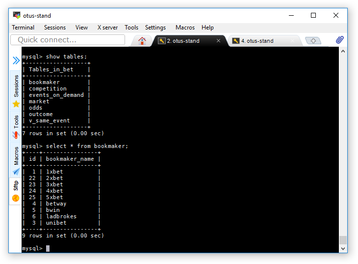
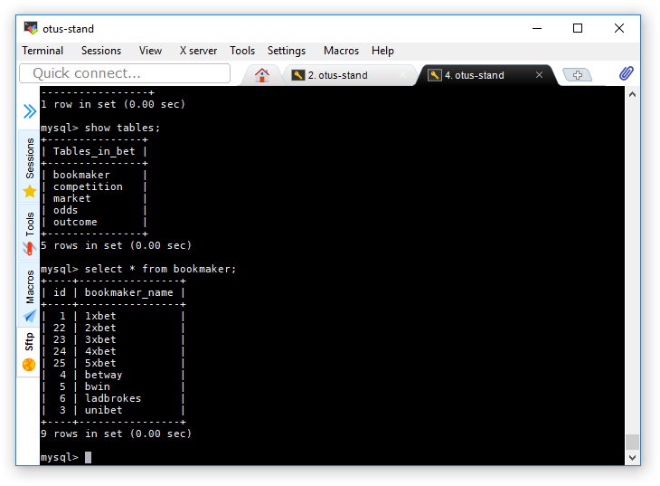

## MySQL репликация

Развернуть на master дамп базы bet и настроить GTID репликацию на slave.
Должны реплицироваться таблицы

- bookmaker
- competition
- market
- odds
- outcome

### 1. DNS

Традиционно используем роль для развертывания DNS сервера, для удобства жизни.

### 2. Master

Разворачиваем master при помощи [плейбука](provisioning/playbook.yml), переносим [конфигурационные файлы](provisioning/mysql-server/master.my.cnf) сервера.

В конфигурационном файле включаем GTID режим репликации, определяем server_id, который должен быть уникальным, указываем таблицы, которые мы будем реплицировать на slave:

<pre>
binlog-checksum=crc32
gtid-mode=on
enforce-gtid-consistency=true
log-slave-updates=true
server-id = 2
replicate-do-db=bet
replicate-do-table=bet.bookmaker
replicate-do-table=bet.competition
replicate-do-table=bet.market
replicate-do-table=bet.odds
replicate-do-table=bet.outcome
</pre>

Так же мы заводим пользователя `repl`, которому даем права на репликацию, создаем базу `bet`, и заливаем в нее файл дампа.

<pre>
$ mysql -u root -pPool-swimming3 -e "CREATE USER 'repl'@'%' IDENTIFIED BY 'Pool-swimming3';"
$ mysql -u root -pPool-swimming3 -e "GRANT REPLICATION SLAVE ON *.* TO 'repl'@'%';"
$ mysql -u root -pPool-swimming3 -e "CREATE DATABASE bet;"
$ mysql -u root -pPool-swimming3 -e "INSERT INTO bookmaker (id,bookmaker_name) VALUES(1,'1xbet');"
$ mysql -u root -pPool-swimming3 bet < db.dump
</pre>

### 3. Slave

Разворачиваем slave при помощи [плейбука](provisioning/playbook.yml), переносим [конфигурационные файлы](provisioning/mysql-server/slave.my.cnf) сервера.
Включаем репликацию на слейв:

<pre>
$ mysql -u root -pPool-swimming3 -e "change master to master_host='master', master_auto_position=1, Master_User='repl', master_password='Pool-swimming3';"
$ mysql -u root -pPool-swimming3 -e "start slave;"
</pre>

Видим в логе репликации:

<pre>
2019-03-14T10:28:27.988218Z 8 [System] [MY-010562] [Repl] Slave I/O thread for channel '': c      onnected to master 'repl@master:3306',replication started in log 'FIRST' at position 4
</pre>

Таблицы, на мастере:

Таблицы, на слейве:

### 4. Ссылки

- https://habr.com/ru/post/262925/
- https://www.cyberciti.biz/faq/run-sql-query-directly-on-the-command-line/
- https://oracle-base.com/articles/mysql/mysql-running-batch-scripts
- https://dev.mysql.com/doc/refman/8.0/en/mysql-batch-commands.html
- https://docs.ansible.com/ansible/latest/modules/shell_module.html