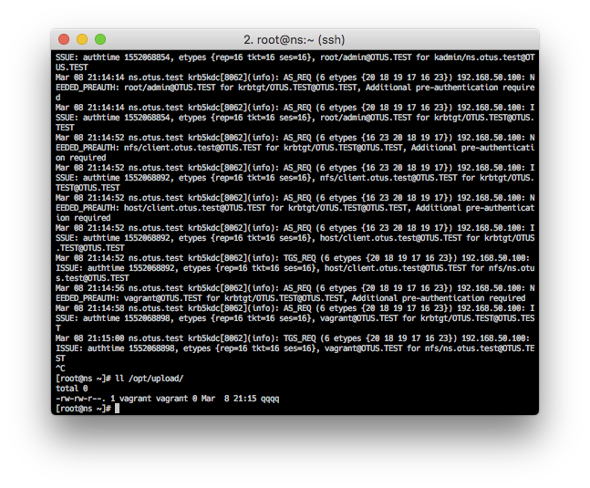
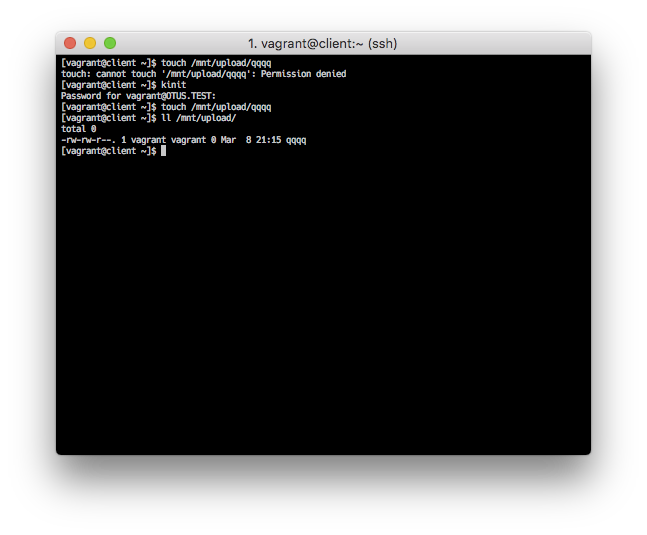

## Керберизованный NFS

Для настройки керберизированных сервисов необходимы работающие в сети службы разрешения имен и синхронизации времени, которые дополнительно будем разворачивать. Центральной частью схемы аутентификации Kerberos является третья доверенная сторона - Key Distribution Center (KDC), которая является централизованным хранилищем информации о пользователях. Перед разворачиванием Kerberos, должен быть выбран сервер, который будет выполнять роль KDC. Физическая и сетевая безопасность критичны для этого сервера, так как его компрометация ведет к компрометации всего realm.   

Требования к Vagrant стенду:

- две виртуальные машины ns.otus.test (сервер KDC, NTP, DNS, NFSv4) и client.otus.test (NFS клиент)
- аутентификация клиента через Kerberos
- автоматическое монтирование на клиенте директории с сервера NFS
- включенный firewalld на сервере

### 1. DNS

Конфигурацию DNS сервера и файлы зоны возьмем из [21 домашнего задания](https://github.com/kakoka/otus-homework/tree/master/hw21). Модифицируем настройки исходя из конфигурации нашего стенда - домен `otus.test`, напишем [роль](provision/roles/dns) развертывания DNS сервера. Внесем изменения в [`/etc/resolv.conf`](provision/roles/dns/files/resolv.conf) на клиенте и на сервере.

### 2. NTP

Настроим штатный сервис синхронизации времени для Centos/7 - `chronyd` как локальный сервер NTP. Сервер будет синхронизироваться с одним из серверов из пула `0.rhel.pool.ntp.org`, клиент будет синхронизироваться уже с нашим сервером. Роли для [сервера](provision/roles/ntp) и для [клиента](provision/roles/ntp-client).

Конфигурация сервера:
<pre>
server 0.centos.pool.ntp.org iburst
manual
allow 192.168.0.0/16
local stratum 8
</pre>

Конфигурация клиента:
<pre>
server ns.otus.test iburst
driftfile /var/lib/chrony/drift
logdir /var/log/chrony
log measurements statistics tracking
</pre>

Соответствующие роли: [сервер](provision/roles/ntp), [клиент](provision/roles/ntp-client).

### 3. Kerberos сервер и клиент

Развернем MIT Kerberos5 сервер и настроим его на аутентификацию в домене `OTUS.TEST`. Для того, что бы было возможно сделать керберизированные сервисы (то есть, один раз, при логине, пройти аутентификацию, получить мандат - `Ticket-Granting Ticket (TGT)`, с помощью которого получить доступ к сервисам внутри `OTUS.TEST` без дополнительного ввода регистрационных данных), необходимо:

- создать базу данных логинов/паролей для пользователей и сервисов использующих Kerberos
- добавить пользователей
- добавить сервисы
- сгенерировать `.keytab` файл (специальный файл, который содержит хеши пароля доменной учётной записи пользователя, с которым ассоциирована та или иная служба в Linux-системе)

В терминологии Kerberos пользователи и сервисы это принципалы, доступ пользователей к сервисам определяется наличием записей о них в базе данных KDC Kerberos.

Примеры команд:
<pre>
$ kdb5_util -P database_password create -r REALM -s
$ kadmin.local
$ addprinc user
$ addprinc -randkey -kvno N service/host@REALM
$ ktadd service/host@REALM
</pre>

Написаны роли для [сервера](provision/roles/kerberos) и для [клиента](provision/roles/kerberos-client).

Подробное описание работы протокола Kerberos доступны в сети, в частности в wikipedia. 

В двух словах: клиент проходит авторизацию, запрос `AS_REQ` - Hash (логин+пароль=хэш) + TimeStamp (синхронизированное время) + ID (id клиента), если этот шаг успешен, то клиент получает TGT (Ticket-Granting Ticket) с помощью которого получает сессионные ключи (TGS) для доступа к сервисам).

Поскольку у нас сервер еще и является сервером NFS то заведем необходимых принципалов и пользователя:

- vagrant@OTUS.TEST
- host/ns.otus.test@OTUS.TEST
- nfs/ns.otus.test@OTUS.TEST

При разворачивании клиента также добавим принципалов, и создадим keytab файлы.

- host/client.otus.test@OTUS.TEST
- nfs/client.otus.test@OTUS.TEST

### 4. NFS сервер и клиент

Для установки nfs сервера написана [роль](provision/roles/nfs4). 

Создаем директорию `/opt/upload` и экспортируем ее `/opt/upload *(rw,no_root_squash,sec=krb5)`. Параметр `sec=krb5` говорит о том, что мы будем использовать Kerberos для авторизации пользователей.

Для клиента написана [роль](provision/roles/nfs4-client), помимо пакета для доступа к nfs-серверу, поставим и настроим сервис `automount` (autofs), который будет подключать на клиенте сетевые папки сервера по мере необходимости. На клиенте будем монтировать сетевые папки в `/mnt`. 

### 5. Firewalld на сервере

Для корректной работы в сети NFS сервера с использованием Kerberos требуется открыть порты для сервисов:

- SSH (22/tcp)
- NTP (123/udp)
- DNS (53/tcp, 53/udp)
- Kerberos (88/tcp, 88/udp, 794/tcp - см. файл [kerberos.xml](provision/roles/firewall/files/kerberos.xml)) 
- NFS (111/tcp, 111/upd - rpc-bind, 2049/tcp, 2049/udp - nfs сервер)

<pre>
firewall-cmd --permanent --add-service=rpc-bind
firewall-cmd --permanent --add-service=mountd
firewall-cmd --permanent --add-port=2049/tcp
firewall-cmd --permanent --add-port=2049/udp
firewall-cmd --reload
</pre>

Добавим их в правила файерволла, написана соответствующая [роль](provision/roles/firewall).

### 6. Использование стенда

После клонирования репозитория, `vagrant up`, `vagrant ssh client`.
При попытке сделать `touch /mnt/upload/something` будет ошибка доступа. Сначала, нужно получить мандат, сделать `kinit`, ввести пароль пользователя vagrant - `vagrant`, и повторить команду `touch`.

На сервере - `tail -f /var/log/krb5kdc.log`.

На клиенте

### 7. Troubleshooting

Все работы были бы весьма затруднительны без возможности отладки kerberos, для этого из документации по утилитам `krb5-workstation` используем переменную `KRB5_TRACE=/dev/stdout`.

Примеры использования:

- сервер: KRB5_TRACE=/dev/stdout /usr/sbin/sshd -d -d -d
- клиент: KRB5_TRACE=/dev/stdout sshd ns.otus.test -vvv

Помимо этого, заметим, что Network Manager живет своей жизнью и насильно вписывает в resolv.conf данные о домене и DNS сервере, исходя из своих представлений, эту опцию нужно отключить.

### 8. TODO

PAM with kerberos. Оно работает, но не совсем правильно, в TODO list.

<pre>
Proper way to automatically create a Kerberos ticket -- it can be used to authenticate Linux services at boot time, for example.

Step 0: run klist -e to list the encryption algorithm(s) that have been negociated with the KDC -- for example "aes256-cts-hmac-sha1-96" and "arcfour-hmac"
NB: that legacy Arc4 is still legit in many corporate Active Directory directories, yuck
- Step 1: create a keytab file for your principal, with ktutil (tutorial here for instance), adding one entry per encryption algorithm
- Step 2: immediately after creating the keytab file, restrict access to the file with chmod, otherwise anyone could use the file to "steal your Kerberos identity"
- Step 3: use kinit -kt <path/to/keytab_file> <principal@REALM> to authenticate without entering the password
- Step 4: you can run kinit -R periodically to request a ticket renewal (that renewal does not require a password) -- provided that you have a renewable ticket, that it has not expired yet, and that you did not reach the max renewable limit (see below)
</pre>

### 9. Ссылки

#### Kerberos

- https://www.ixbt.com/comm/kerberos5.shtml
- https://pikabu.ru/story/kak_rabotaet_kerberos_5_v_kartinkakh_5271729
- https://www.systutorials.com/docs/linux/man/8-pam_krb5/
- https://www.tldp.org/HOWTO/Kerberos-Infrastructure-HOWTO/client-configure.html
- https://www.techrepublic.com/blog/linux-and-open-source/kerberos-authentication-with-nfsv4/
- https://www.certdepot.net/rhel7-configure-kerberos-kdc/
- https://codingbee.net/rhce/rhce-kerberos#Kerberos-Client-Setup
- https://blog.it-kb.ru/tag/kerberos/
- https://pro-ldap.ru/tr/zytrax/tech/kerberos.html
- https://gist.github.com/ashrithr/4767927948eca70845db

#### NFS

- https://www.howtoforge.com/tutorial/setting-up-an-nfs-server-and-client-on-centos-7/
- https://www.lisenet.com/2016/setup-nfs-server-on-centos-7-and-configure-client-automount/
- http://tdkare.ru/sysadmin/index.php/Autofs
- https://serverfault.com/questions/389189/understanding-nfs4-linux-server
- https://codingbee.net/rhce/nfs-set-up-an-nfs-server-on-centos-rhel-7
- https://www.tecmint.com/configure-nfs-server/
- https://www.tecmint.com/setting-up-nfs-server-with-kerberos-based-authentication/

#### Autofs

- https://wiki.archlinux.org/index.php/Autofs_(%D0%A0%D1%83%D1%81%D1%81%D0%BA%D0%B8%D0%B9)
- https://help.ubuntu.com/community/Autofs
- https://linuxconfig.org/how-to-configure-the-autofs-daemon-on-centos-7-rhel-7
- https://www.thegeekdiary.com/beginners-guide-to-automounting-file-systems-in-centos-rhel/

#### PAM

- https://www.oreilly.com/library/view/linux-security-cookbook/0596003919/ch04s17.html
- https://serverfault.com/questions/855859/mit-kerberos-keeps-asking-for-password-when-authenticating-to-openssh

#### Разное
- https://www.danbishop.org/2015/01/30/ubuntu-14-04-ultimate-server-guide/
- https://kb.iu.edu/d/aumh
- https://runops.wordpress.com/2015/04/22/create-machine-keytab-on-linux-for-active-directory-authentication/
- https://jimshaver.net/2016/05/30/setting-up-an-active-directory-domain-controller-using-samba-4-on-ubuntu-16-04/
- https://www.thegeekdiary.com/how-to-add-or-delete-a-samba-user-under-linux/
- https://lists.samba.org/archive/samba/2017-February/206616.html
- http://koo.fi/blog/2015/06/16/ubuntu-14-04-active-directory-authentication/
- https://www.altlinux.org/%D0%A1%D0%BE%D0%B7%D0%B4%D0%B0%D0%BD%D0%B8%D0%B5_SPN_%D0%B8_Keytab_%D1%84%D0%B0%D0%B9%D0%BB%D0%B0
- https://access.redhat.com/documentation/en-us/red_hat_enterprise_linux/6/html/deployment_guide/s1-checking_the_status_of_ntp
- https://www.certdepot.net/rhel7-configure-kerberos-kdc/
- https://ping.force.com/Support/servlet/fileField?retURL=%2FSupport%2Fapex%2FPingIdentityArticle%3Fid%3DkA3400000008RZLCA2&entityId=ka3400000008XOTAA2&field=Associated_File__Body__s
- https://help.ubuntu.com/community/Samba/Kerberos