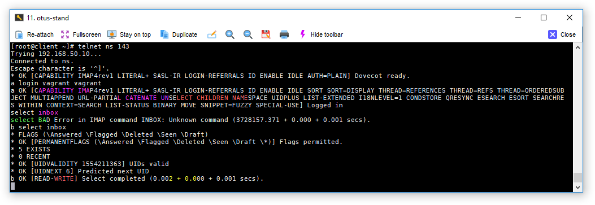
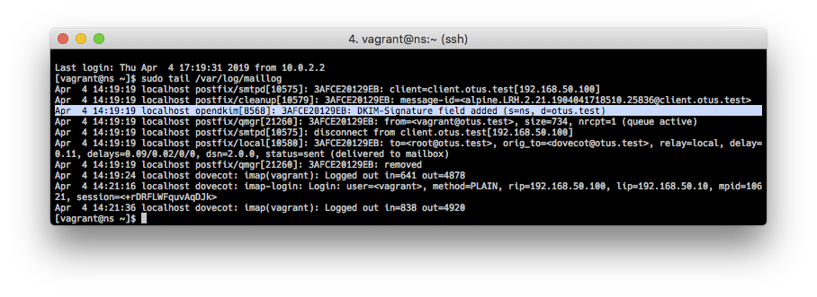
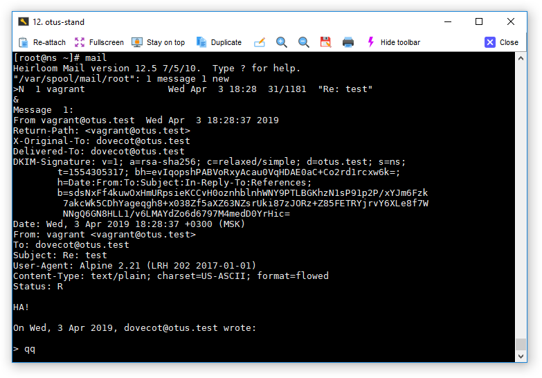
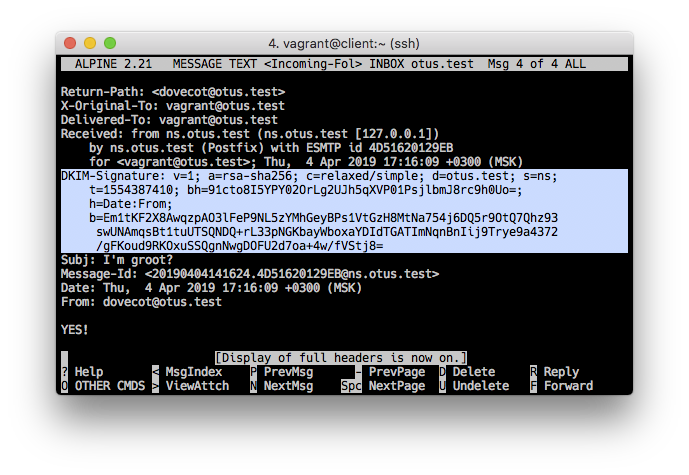

## Почтовый сервер: Postfix, Dovecot

### Задача:

1. Установить postfix и dovecot для приёма почты на виртуальный домен;
2. Отправить почту телнетом с клиента на сервер;
3. Принять почту на клиент почтовым клиентом.

Соберем стенд из двух виртуальных машин `ns.otus.test` и `client.otus.test`. Развернем на `ns.otus.test` сервис DNS с записями в файле зоны относящимися к работе почтового сервера, настроим postfix, установим и настроим opendkim и dovecot. 

### 1. DNS

Конфигурацию DNS сервера и файлы зоны возьмем из [21 домашнего задания](https://github.com/kakoka/otus-homework/tree/master/hw21). Модифицируем [роль](provision/roles/dns) развертывания DNS сервера исходя из требований задачи. Будем использовать связку DKIM c spf.

Изменим файл зоны `otus.test`, добавим MX и TXT записи:

<pre>
$TTL 3600
$ORIGIN otus.test.
@               IN      SOA     ns.otus.test. root.otus.test. (
                            1502201901 ; serial
                            3600       ; refresh (1 hour)
                            600        ; retry (10 minutes)
                            86400      ; expire (1 day)
                            600        ; minimum (10 minutes)
                        )
                        IN      NS      ns.otus.test.
otus.test.              IN      MX      10 ns.otus.test.

ns                      IN      A       192.168.50.10
client                  IN      A       192.168.50.100

otus.test.              IN      TXT     "v=spf1 mx a ip4:192.168.50.10 a:ns.otus.test -all"
ns._domainkey.otus.test IN      TXT     "v=DKIM1\;k=rsa\;p=xxxxxx...xxxx"
</pre>

Укажем в файле зоны, что `ns.otus.test` предназначен для работы в качестве почтового сервера (тип записи MX). В TXT записи `otus.test. IN TXT "v=spf1 mx a ip4:192.168.50.10 a:ns.otus.test -all"` укажем, что этот же сервер уполномочен отправлять почту от имени нашего домена. В другой TXT записи укажем публичный ключ домена `ns._domainkey.otus.test IN TXT "v=DKIM1\;k=rsa\;p=xxxxxx...xxxx"` (вместо `xxx.xxx` - в файле зоны прописан публичный ключ для дешифровки подписанных приватным ключом заголовков сообщений). Сгенерируем заранее приватный/публичный ключи и добавим приватный ключ в файлы роли настройки [postfix](provision/roles/postfix).

### 2. Postfix

Для настройки postfix написана [роль](provision/roles/postfix), которая копирует конфигурационный файл с настройками в `/etc/postfix/main.cf`. В нем указываем имя домена, доверенные сети, интерфейсы и т.д. 

Дополнительно вместе с postfix развернем opendkim сервис для работы с цифровой подписью. Добавим в main.cf настройки для совместной работы с postfix:

<pre>
milter_protocol = 2
milter_default_action = accept
smtpd_milters = inet:localhost:50055
non_smtpd_milters = inet:localhost:50055
</pre> 

Конфигурация opendkim:

<pre>
Domain                  otus.test
Socket                  inet:50055@localhost
Syslog                  Yes
SyslogSuccess           Yes
LogWhy                  Yes
AutoRestart             Yes
AutoRestartRate         10/1h
Umask                   002
Canonicalization        relaxed/simple
ExternalIgnoreList      refile:/etc/opendkim/TrustedHosts
InternalHosts           refile:/etc/opendkim/TrustedHosts
KeyTable                refile:/etc/opendkim/KeyTable
SigningTable            refile:/etc/opendkim/SigningTable
Mode                    sv
PidFile                 /var/run/opendkim/opendkim.pid
SignatureAlgorithm      rsa-sha256
UserID                  opendkim:opendkim
</pre>

В `/etc/opendkim/keys` положим наш приватный ключ и установим ему права только на чтение.

### 3. Dovecot

Написана роль для установки [Dovecot](provision/roles/dovecot). В конфигурационных файлах включены протоколы pop3 и imap ([dovecot.conf](provision/roles/dovecot/files/dovecot.conf)), отключена возможность установки соединения по ssl (для упрощения работы - [10-ssl.conf](provision/roles/dovecot/files/10-ssl.conf)), определены каталоги для хранения почты пользователей `mail_location = mbox:~/mail:INBOX=/var/mail/%u` ([10-mail.conf](provision/roles/dovecot/files/10-mail.conf)), включена аутентификация с передачей незашифрованных паролей `disable_plaintext_auth = no` ([10-auth.conf](provision/roles/dovecot/files/10-auth.conf)). 

C помощью шаблона генерируется файл с учетными записями пользователей:

```python

{{ user.name }}:{PLAIN}{{ user.password }}:{{ user.uid }}:{{ user.gid }}::/home/{{ user.name }}

```

### 4. Использование стенда

После клонирования репозитория, `vagrant up`, `vagrant ssh client`. На клиент установлен почтовый клиент `alpine`, который уже пред настроен на работы с почтовым сервером по протоколу imap (логин/пароль: vagrant/vagrant).

Тест отправки почты на сервере (с клиента тоже работает):



В `/var/log/maillog` Видим, как добавилась цифровая подпись к отправляемому письму. Так же видим в логе, как подключился клиент по `imap` с `client.otus.test`.



Список тестовых писем.



Смотрим заголовки письма, видим DKIM-Signature:



### 5. Ссылки

- https://habr.com/ru/company/ruvds/blog/325356/
- https://support.rackspace.com/how-to/dovecot-installation-and-configuration-on-centos/
- https://rimuhosting.com/support/bindviawebmin.jsp#dns
- https://blog.bissquit.com/unix/debian/bazovaya-nastrojka-postfix-i-dovecot/
- http://snakeproject.ru/rubric/article.php?art=freebsd_postfix_dovecot_dkim_09.2018
- http://www.shakthimaan.com/installs/alpine-email-setup.html
- https://docs.gitlab.com/ee/administration/reply_by_email_postfix_setup.html