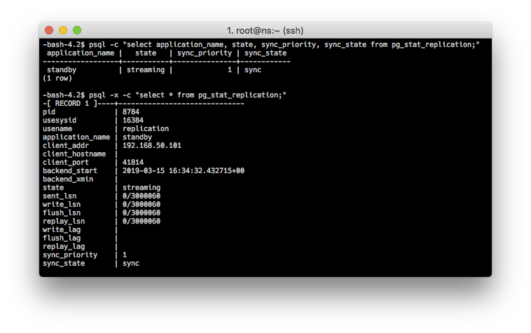
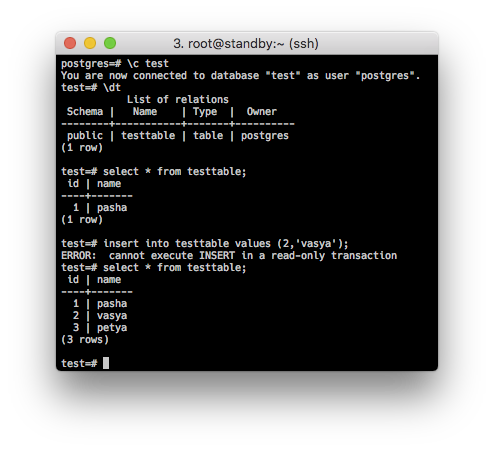
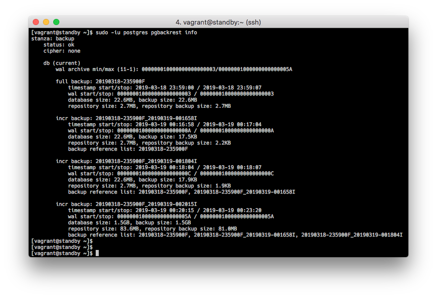
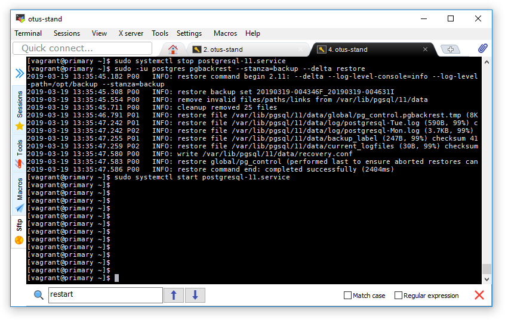

## PostgreSQL репликаци и резервное копирование

Задача:

- Настроить hot_standby репликацию с использованием слотов.
- Настроить правильное резервное копирование.

Описание стенда:

Развивая тему керберизованных сервисов, будем использовать стенд из [домашней работы 26](https://github.com/kakoka/otus-homework/tree/master/hw26). Развернем сервисы: DNS, NTP, Kerberos, NFS. После старта этих сервисов развернем PostgreSQL 11, настроим потоковую репликацию и резервное копирование. 

Две виртуальные машины:

- primary.otus.test - серверы DNS, NTP, Kerberos, NFS и PostgresSQL в режиме primary.
- standby.otus.test - PostgresSQL в режиме hot_standby.

Для резервного копирования будем использовать `pgbackrest`.

**Общая идея:**

Поскольку Postgres умеет авторизовать пользователей через керберос, используем это для настройки авторизации в Postgres. На primary.otus.test разворачиваем Postgres, настраиваем его в режиме primary, так же настраиваем потоковую репликацию с использованием слотов. 

На standby.otus.test разворачиваем Postgres в режиме `hot_standby`.

На обоих хостах установим `pgbackrest`, что бы была возможность инкрементального резервного копирования как с primary, так и со standby сервера. Для этого необходим общий репозиторий, который должен находиться на NFS ресурсе, для чего нужен работающий NFS сервер.

### 0. Подготовка

Развертывание сервисов NTP, DNS и NFS описана в [домашнем задании 26](https://github.com/kakoka/otus-homework/tree/master/hw26). Внесены небольшие поправки:

- записи A в файлах зон DNS сервера (primary, standby);
- standby синхронизируется primary по времени - изменение в конфиге chronyd;
- добавлены принципалы в базу данных Kerberos (postgres@OTUS.TEST, postgres/primary.otus.test@OTUS.TEST и тд.);
- экспортируется папка `/opt/backup` в настройках NFS сервра primary.otus.test;
- на standby.otus.test в `/opt/standby` монтируется папка с primary.otus.test;

Написаны [**ansible роли**](https://github.com/kakoka/otus-homework/tree/master/hw28/provision/roles) для всех компонентов стенда.

### 1. Репликация

#### 1. Настройка primary

После установки сервера, инициализации БД и старта сервера, заведем пользователя `replication` от имени которого будет выполянться репликация, установим пароль и ограничение на количество одновременных активных соединений:

```sql
$ sudo -iu postgres psql -c "CREATE USER replication REPLICATION LOGIN CONNECTION LIMIT 5 ENCRYPTED PASSWORD 'swimming3';"
```

##### 1.1 pg_hba.conf

Внесем следующие изменения:

<pre>
host replication replication primary.otus.test trust
host replication replication standby.otus.test trust
host all         all         192.168.50.0/24   gss map=mymap include_realm=0 krb_realm=OTUS.TEST
</pre>

Для доступа реплики к мастеру используем `trust`, для остальных пользователей из нашей подсети используем Kereberos авторизацию.

##### 1.2 postgres.conf

Внесем следующие изменения:

<pre>
# CONNECTIONS AND AUTHENTICATION
listener_address   = 192.168.50.100
krb_server_keyfile = '/usr/local/pgsql/etc/krb5.keytab'

# WRITE-AHEAD LOG
wal_level = hot_standby
synchronous_commit = local
archive_mode = on
archive_command = 'pgbackrest --stanza=backup archive-push %p' 

# REPLICATION - Sending Servers 
max_wal_senders = 2
wal_keep_segments = 10
max_replication_slots = 10
synchronous_standby_names = 'standby'
</pre>

##### 1.3 pg_ident.conf

Здесь мы определим варианты сопоставления пользователей, т.е. какой пользователь под каким именем может соединятся с БД. Документация [тут](https://postgrespro.ru/docs/postgresql/11/auth-username-maps).

<pre>
mymap portgres replication
mymap postgres postgres
mymap vagrant  postgres
</pre>

После всех изменений выполняем `systemctl restart postgresql-11`.

##### 1.4 pgbackrest.conf

Этот файл имеет отношения к резервному копированию. Нам необходимо инициализировать репозиторий с резервными копиями. Его основные параметры определяются в файле `/etc/pgbackrest.conf`.

<pre>
[global]
repo1-path=/opt/backup
repo1-retention-full=2
process-max=2
log-level-console=info
log-level-file=debug

[backup]
pg1-path=/var/lib/pgsql/11/data
</pre>

Выполняем команду, которая создаст репозиторий для бэкапа:

```bash
$ sudo -iu postgres pgbackrest --stanza=backup --log-level-console=info stanza-create
```

и сделаем первый бэкап:

```bash
pgbackrest --stanza=backup --log-level-console=info backup
```

#### 2. Настройка standby

Останавливаем постгрес, удаляем текущую `/var/lib/pgsql/11/data` из создаем ее снова, не забывая выставить нужные права.

Выполняем со `standby.otus.test` резервное копирование базы сервера `primary.otus.test` в директорию `/var/lib/pgsql/11/data`:

```bash
$ sudo -iu postgres kinit 
$ sudo -iu postgres pg_basebackup -h primary.otus.test \
  -U replication -D /var/lib/pgsql/11/data -P --wal-method=stream
```

Вносим правки в postgres.conf:

<pre>
listener_address = 192.168.50.101
hot_standby = on
</pre>

Добавляем recovery.conf:

<pre>
standby_mode = on
primary_conninfo = 'host=primary.otus.test port=5432 user=replication password=swimming3 application_name=standby'
restore_command = 'pgbackrest --stanza=backup archive-get %f "%p"'
trigger_file = '/tmp/postgresql.trigger.5432'
recovery_target_timeline = 'latest'
</pre>

И запускаем постгрес.

#### 3. Проверка работы репликации

**primary**

Вывод запросов к серверу о статусе репликации:

```bash
$ sudo -iu postgres psql -c "select application_name, state, sync_priority, sync_state from pg_stat_replication;"
$ sudo -iu postgres psql -x -c "select * from pg_stat_replication;"
```


Подключимся к базе данных:

```bash
$ sudo -iu postgres
$ psql
```

Создаем базу данных и подключимся к ней:

```sql
postgres=# create database test;
postgres=# \c test
```

Создадим таблицу testtable и добавим в нее данные:

```sql
test=# create table testtable( id serial primary_key, name varchar(50);
test=# insert into testtable values (1,'pasha');
test=# insert into testtable values (2,'vasya'),(3,'petya');
```


**standby**

Подключимся к базе данных и сделаем запрос на выборку:

```bash
$ sudo -iu postgres
$ psql
postgres=# \c test
postgres=# select * from testtable;
```



#### 4. Backup: pgbackrest

Поиски решения для **правильного** резервного копирования привели к утилите `pgbackrest`, которая имеет черезвычайно богатый функционал при достаточно простой настройке. 

- параллельный бэкап и восстановление;
- операции на локальном и удаленном сервере;
- полный, инкрементальный и дифференциальный бэкап;
- ротация бэкапов и проверка целостности;
- компрессия и шифрование;
- поддержка tablespace;
- поддержка Amazon S3;
- и т.д.

Будем настраивать резервное копирование с реплики (standby) на NFS ресурс на сервере (primary) :-] (конечно в реальной жизни это отдельно стоящий NFS сервер). Создаем два конфигурационных файла, и выполним первый полный бэкап на primary и инкрементальный бэкап на standby. Конфиги [primary](provision/roles/pgsql11-primary/templates/pgbackrest.conf.j2) и [standby](provision/roles/pgsql11-standby/templates/pgbackrest.conf.j2). 

Утилита оперирует понятием `stanza`, которое эквивалентно понятию "сервер(ы), который мы бэкапим". Описывается этот параметр в конфигурационном файле:

Для `primary.otus.test`:

<pre>
[backup]
pg1-path=/var/lib/pgsql/11/data
</pre>

Для `standby.otus.test`:

<pre>
[backup]
pg1-host=primary.otus.test
pg1-path=/var/lib/pgsql/11/data
pg2-path=/var/lib/pgsql/11/data
recovery-option=standby_mode=on
recovery-option=primary_conninfo=host=primary.otus.test user=replication
recovery-option=recovery_target_timeline=latest
</pre>

В секции [global] описывается репозиторий, который находится в /opt/backup на primary.otus.test, и подключен через NFS к standby.otus.test:

<pre>
[global]
repo1-path=/opt/backup
repo1-retention-full=1
process-max=2
log-level-console=info
log-level-file=debug
backup-standby=y
delta=y
</pre>

Полный бэкап с primary:

```bash
$ sudo -iu postgres pgbackrest --stanza=backup --log-level-console=info --type=incr backup
```



Инкрементальный бэкап со standby:

```bash
$ sudo -iu postgres pgbackrest --stanza=backup --log-level-console=info --type=incr backup
```


Восстановление primary:

```bash
$ sudo -iu postgres pgbackrest --stanza=backup --delta restore
```



**NB:** Утилита позволяет реализовать нам все возможные стратегии резервного копирования, путем включения в запуск по расписанию, типы бэкапа, синхронное и асинхронное исполнение и т.д., невероятное богатство возможностей.

### 5. Использование стенда

После клонирования репозитория:

<pre>
$ vagrant up
$ vagrant ssh standby
$ sudo -iu postgres pgbackrest --stanza=backup --log-level-console=info --type=incr backup
$ sudo -iu postgres pgbackrest info
</pre>

Через провижн при старте ВМ выполнится полный бэкап primary, при вводе вышеприведенных команд должен произойти инкрементальный бэкап.

Командной `sudo -iu postgres pgbackrest info` можно посмотреть статус репозитория, какие резеврные копии он содержит.

### 6. Ссылки

- https://blog.vpscheap.net/how-to-setup-replication-for-postgresql-in-centos-7/
- https://linuxhint.com/setup_postgresql_replication/
- https://opensource.com/article/17/6/ansible-postgresql-operations
- https://www.postgresql.org/docs/11/gssapi-auth.html
- https://info.crunchydata.com/blog/pgbackrest-performing-backups-on-a-standby-cluster
- https://shiningapples.net/%D0%BD%D0%B0%D1%81%D1%82%D1%80%D0%BE%D0%B9%D0%BA%D0%B0-%D0%B1%D0%B5%D0%BA%D0%B0%D0%BF%D0%B0-postgresql-%D0%B2-ubuntu-server-%D0%BF%D1%80%D0%B8-%D0%BF%D0%BE%D0%BC%D0%BE%D1%89%D0%B8-pgbackrest-%D1%81/
- https://pgconf.ru/media/2017/04/04/EgorRogov_pg_probackup_script.txt
- https://pgstef.github.io