## Курсовой проект 

### Высокодоступная кластерная файловая система интегрированная с кластером СУБД, централизованной системой телеметрии, аудита и авторизации. 

### 1. Описание стенда 

Для развертывания всех компонент системы использован Vagrant, с помощью которого разворачивается стенд, состоящий из 7 виртуальных машин:

- 1 виртуальная машина - центральный сервер телеметрии, аудита и авторизации
- 6 виртуальных машин - кластерная файловая система, кластер СУБД

Для экономии ресурсов совместим 3 узла кластера СУБД с узлами кластерной файловой системы. 

Для развертывания всех компонент системы используется Ansible.

Названия виртуальных машин:

- ns.otus.test (ns) - Центральный сервер телеметрии, аудита и авторизации
- master01.otus.test (master01) - узел кластерной ФС, узел кластера СУБД 
- master02.otus.test (master02) - узел кластерной ФС, узел кластера СУБД
- master03.otus.test (master03) - узел кластерной ФС, узел кластера СУБД
- node01.otus.test (node01) - узел кластерной ФС
- node02.otus.test (node04) - узел кластерной ФС
- node03.otus.test (node03) - узел кластерной ФС

#### 1.1 Центральный сервер телеметрии, аудита и авторизации

Для устойчивой работы всех компонент стенда необходимо развернуть первую виртуальную машину на которой установим следующие сервисы:

- [DNS](provision/roles/dns) - локальный сервер разрешения имен,
- [NTP](provision/roles/ntp) - локальный сервер точного времен,
- [Kerberos](provision/roles/kerberos) - локальный сервер авторизации,
- [Prometheus](provision/roles/prometheus) - центральный сервер сбора телеметрии,
- [Grafana](provision/roles/grafana) - сервер визуализации телеметрии,
- [Netdata](provision/roles/netdata-central) - центральный сервер сбора и визуализации телеметрии в реальном времени,
- [Lizardfs-cgi](provision/roles/lizard-client) - сервер отображения состояния кластерной файловой системы,
- [Lizardfs-client](provision/roles/lizard-client) - клиент для подключения к кластерной файловой системе
- [Haproxy](provision/roles/haproxy) - балансировщик нагрузки на кластер СУБД
- [Etcd](provision/roles/etcd) - key-value база данных для кластера СУБД 
- [Auditd](provision/roles/audit-server) - центральный сервер для сбора событий аудита всех компонент системы
- [Nginx](provision/roles/nginx) - web сервер, работающий в режиме reverse-proxy
- [Autofs](provision/roles/autofs) - сервиc автомонтирования сетевых ресурсов

DNS, NTP, Kerberos, Etcd сервисы необходимы для интеграции сервисов и их компонент.

#### 1.2 Узлы файловой кластерной системы и кластера СУБД

На всех узлах кластера развернуты следующие вспомогательные сервисы:

- [NTP](provision/roles/ntp-client) - клиент синхронизации с локальным NTP сервером
- [Kerberos](provision/roles/kerberos-client) - kerberos клиент
- [Auditd](provision/roles/audit-client) - клиент auditd
- [Netdata](provision/roles/netdata-client) - клиент сбора телеметрии 

На узлах master01-master03 развернуты роли:

- [LizardFS Uraft Master Node](provision/roles/lizard-master) - lizardfs-mfsmaster, lizardfs-uraft
- [PostgreSQL 11](provision/roles/pgsql11) - сервер PostgreSQL 11
- [TimescaleDB](provision/roles/timescaledb) - расширение для PostgreSQL, позволяующее использовать Постгрес как TimeseriesDB
- [Patroni](provision/roles/patroni) - создание кластера PostgreSQL

На узлах node01-node03 развернуты роли:

- [LizardFS Node](provision/roles/lizard-node) - lizardfs-chunkserver, lizardfs-metalogger
- [LVM](provision/roles/lvm2) - управление томами LVM2

#### 1.3 Использование стенда

После клонирования репозитория, в папке с проектом (otus-homework/project) выполняем `vagrant up`. После развертывания стенда станут доступны следующие ресурсы (наружу проброшен порт 8080):

- Мониторинг ресурсов узлов кластера в реальном времени - [http://localhost:8080/netdata/](http://localhost:8080/netdata/)
- Мониторинг ресурсов узлов кластера [http://localhost:8080/prometheus/](http://localhost:8080/netdata/)
- Визуализация телеметрии [http://localhost:8080/grafana/](http://localhost:8080/netdata/)
	- необходимо выполнить вход (логин/пароль: admin/admin)
	- необходимо добавить источник данных (datasource)
		- Name: PostgreSQL
		- Host: ns
		- Database: postgres
		- User/Password: postgres/postgres
		- SSL Mode: disable
		- Version: 10
		- TimescaleDB: checked
		- <details><summary>посмотреть пример</summary>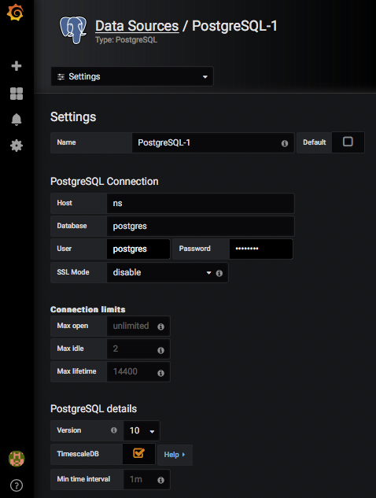</details>
	- необходимо выполнить импорт тестового Dasboard [sample-netdata-dashboard](provision/roles/grafana/files/dashboard.json): 
		- <details><summary>посмотреть пример</summary>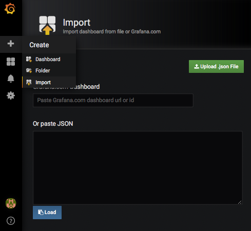</details>
- Мониторинг состояния кластера СУБД [http://localhost:8080/haproxy/](http://localhost:8080/haproxy/)
	- необходимо выполнить вход (логин/пароль: someuser/password)
- Мониторинг состояния кластерной файловой системы [http://localhost:8080/lizardfs/mfs.cgi?masterport=9421&masterhost=master&sections=CS](http://localhost:8080/lizardfs/mfs.cgi?masterport=9421&masterhost=master&sections=CS)

Попадаем в ВМ `ns` стенда и выполняем `kinit` (пароль: vagrant): 

```bash
$ vagrant ssh ns
$ echo "vagrant" | kinit
$ sudo aureport -x --summary
```

Далее можно заходить на все ноды кластера без ввода пароля.

### 2. Компоненты стенда

Общая схема стенда с разделением ролей:

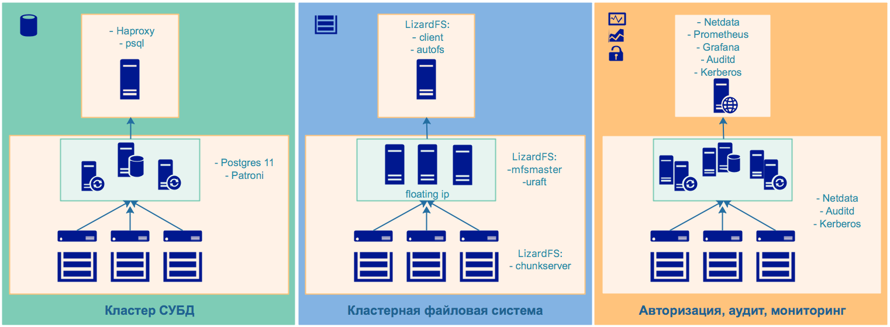


#### 2.1 Высокодоступная кластерная файловая система

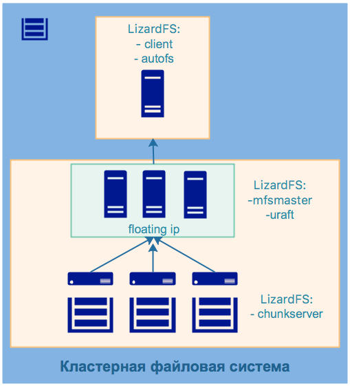

Для проекта была выбрана кластерная файловая система [LizardFS](https://lizardfs.org/). Это распределенная, масштабируемая, отказоустойчивая и высокодоступная файловая система. Она позволяет объединять дисковое пространство, расположенное на многих серверах, в единое пространство имен, которое видно в Unix-подобных системах и системах Windows так же, как и в других файловых системах. LizardFS обеспечивает безопасность файлов, сохраняя все данные во многих репликах на доступных серверах. Ее также можно использовать для создания доступного хранилища, поскольку она работает без каких-либо проблем на обычном оборудовании.

Отказы дисков и серверов обрабатываются прозрачно, без простоев и потери данных. Если требования к хранилищу растут, можно масштабировать существующую установку LizardFS, просто добавляя новые серверы - в любое время, без простоев. Система автоматически перемещает данные на вновь добавленные серверы, потому что она постоянно заботится о балансировке использования диска на всех подключенных узлах. Удаление серверов так же просто, как добавление нового.

Уникальные функции:

- поддержка многих центров обработки данных и типов носителей,
- быстрые снимки,
- механизмы QoS,
- квоты,
- ...

LizardFS хранит метаданные (например, имена файлов, метки времени изменения, деревья каталогов) и фактические данные отдельно. Метаданные хранятся на серверах метаданных, а данные хранятся на компьютерах, называемых серверами чанков. Типичная установка состоит из:

- Как минимум два сервера метаданных, которые работают в режиме master-slave для восстановления после сбоев. Их роль также заключается в управлении всей установкой, поэтому активный сервер метаданных часто называют главным сервером. Роль других серверов метаданных состоит в том, чтобы просто синхронизировать их с активными главными серверами, поэтому их часто называют теневыми главными серверами. Любой теневой мастер-сервер в любое время готов взять на себя роль активного мастер-сервера.
- Сhunkservers, серверы хранения данных. Каждый файл делится на блоки, называемые чанками (каждый размером до 64 МБ), которые хранятся на серверах чанков. Предлагаемая конфигурация сервера чанков - это машина с большим дисковым пространством, доступным в конфигурации JBOD или RAID, в зависимости от требований. Процессор и оперативная память не очень важны. У вас может быть всего 2 чанк-сервера (минимум, чтобы ваши данные были устойчивы к любым сбоям диска) или до сотен из них. Типичный чанксервер оснащен 8, 12, 16 или даже более жесткими дисками. Каждый файл может распространяться на серверы чанков в определенном режиме репликации: standard, xor или ec.
- Клиенты, которые используют данные, хранящиеся в LizardFS. Эти машины используют монтирование LizardFS для доступа к файлам при установке и обработки их так же, как файлы на локальных жестких дисках. Файлы, хранящиеся в LizardFS, могут быть просмотрены и одновременно доступны как можно большему числу клиентов.

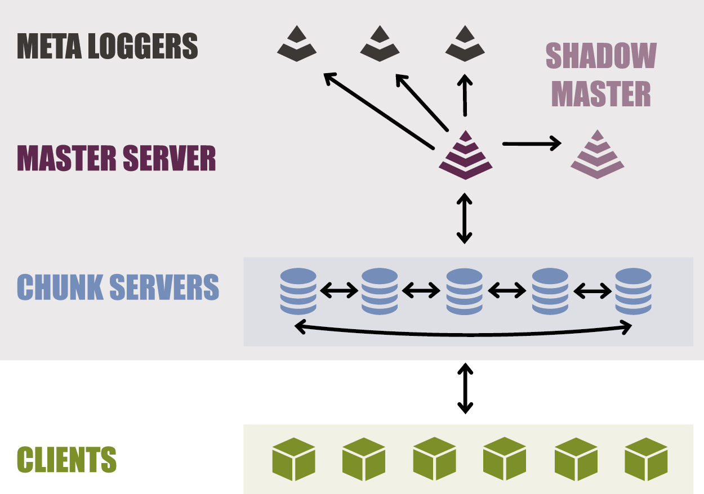

Режим репликации каталога или даже файла может быть определен индивидуально.

- **standard**, режим предназначен для явного определения количества копий фрагментов данных, которые вы хотите сохранить в кластере, и на определенной группе узлов. В сочетании с «пользовательскими целями» (goals) это удобно для гео-репликации.
- **xor**, похож на механизм репликации известный в RAID5.
	- <details><summary>иллюстрация</summary>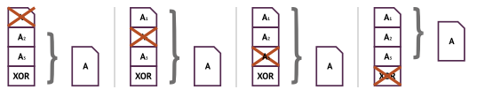</details>
- **ec - erasure coding**, похож на механизм репликации известный в RAID6.
	- <details><summary>иллюстрация</summary>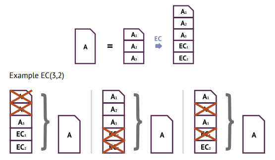</details>

Отдельный инструмент для обеспечения высокой доступности - LizardFS Uraft, стал доступен OpenSource сообществу в июле 2018 года. Компонент предназначен для организации высокодоступного кластера файловой системы.

Схема развертывания кластерной ФС:

- устанавливаем мастер-сервера (ноды master01-master03)
- устанавливаем компонент высокой доступности uraft (ноды master01-master03)
- запускаем uraft, который запускает мастер-сервера на каждой из мастер-нод
- проводятся выборы, где определяется главный мастер-сервер
- ноде, на которой определен главный мастер сервер назначается плавающий ip
- остальные мастер-ноды устанавливаются в режим shadow
- устанавливаем и запускаем чанк сервера (ноды node01-node03), которые соединяются с мастер-сервером


В нашем примере на ВМ **master01-master03** развернуты компоненты lizardfs-mfsmaster, lizardfs-uraft. Для обеспечения высокой доступности используется технология floating ip. При остановке главного мастер-сервера, происходят выборы, выбирается новый ведущий мастер, которому назначается плавающий ip. 

На ВМ **node01-node03** развернуты компоненты lizardfs-chunkserver, lizardfs-metalogger, к каждой ноде подключен диск, который смонтирован в систему. В конфигурации сервера чанков он определен, как доступный для работы внутри кластерной файловой системы.

На ВМ **ns** установлен компонент lizardfs-client, lizardfs-admin, lizardfs-cgiserv с помощью которых монтируется, управляется и мониторится кластерная файловая система. Так же установлен сервис autofs, для автоматического монтирования ФС в /data/lizard.

Пример монтирования ФС:

```
$ mfsmount -o big_writes,nosuid,nodev,noatime,allow_other -o cacheexpirationtime=500 -o readaheadmaxwindowsize=4096 /mnt
```

Проверка статусов мастер-серверов:

```bash
$ for i in {1..3}; do telnet master0$i 9428; done
```

<details><summary>Вывод команды:</summary>
<pre>
<b><font color="gray">Trying 192.168.50.21...
Connected to master01.</font></b>
Escape character is '^]'.
SERVER ID 0
<b><font color="red">I'M THE BOOSSSS</font></b>
president=1
<b><font color="blue">state=LEADER</font></b>
term=586
voted_for=0
leader_id=0
data_version=1
loyalty_agreement=0
local_time=3550745
blocked_promote=0
votes=[       1|       1|       1]
heart=[    0.00|    0.00|    0.00]
recv =[       1|       1|       1]
ver  =[       1|       1|       1]
Connection closed by foreign host.
<b><font color="gray">Trying 192.168.50.22...
Connected to master02.</font></b>
Escape character is '^]'.
SERVER ID 1
president=0
<b><font color="blue">state=FOLLOWER</font></b>
term=586
voted_for=0
leader_id=0
data_version=1
loyalty_agreement=1
local_time=3567651
blocked_promote=0
Connection closed by foreign host.
<b><font color="gray">Trying 192.168.50.23...
Connected to master03.</font></b>
Escape character is '^]'.
SERVER ID 2
president=0
<b><font color="blue">state=FOLLOWER</font></b>
term=586
voted_for=-1
leader_id=0
data_version=1
loyalty_agreement=1
local_time=3551294
blocked_promote=0
Connection closed by foreign host.
</pre>
</details>

Мониторинг состояния файловой системы:

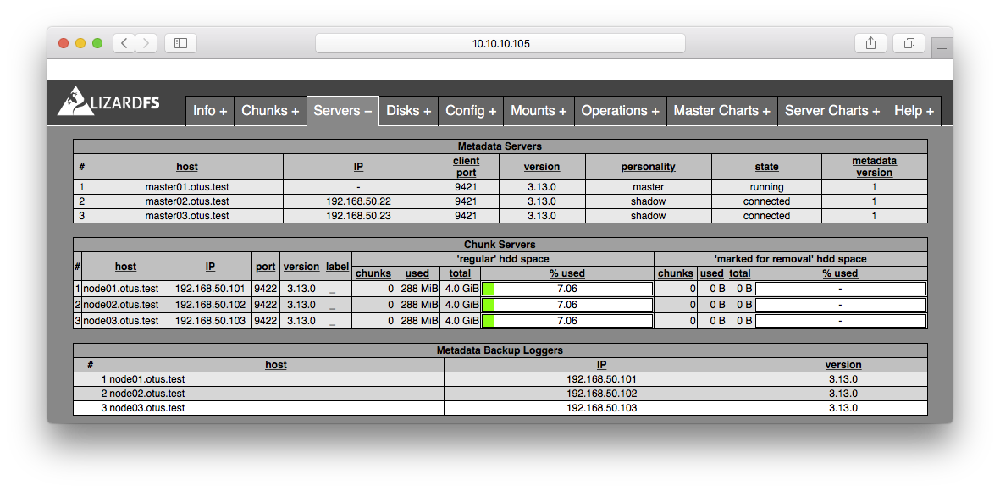

#### 2.1 Кластер СУБД

Схема кластера:

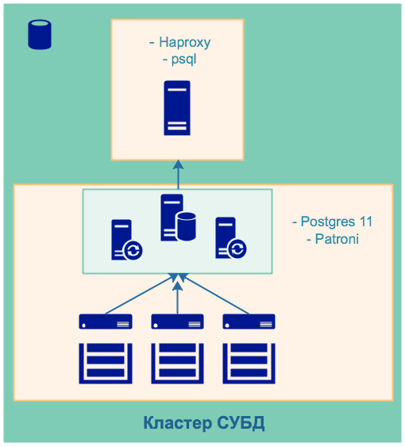

Кластер высокой доступности Postgres. Развертывание кластера идентично выполненной работе в [ДЗ 29](https://github.com/kakoka/otus-homework/tree/master/hw29).

Разворачиваемы компоненты:

- PostgreSQL 11
- Patroni
- TimescaleDB

Однако, есть дополнения, в виде установки двух расширений для использования Postgres в качестве Timeseries DB (об этом ниже в разделе **2.3 Мониторинг**). Установлены расширения `TimescaleDB` и `pg_prometheus`. 

Первое - позволяет сохранять в БД временные ряды, используя при этом партиционирование таблиц, второе - позволяет взаимодействовать с системой мониторинга Prometheus. Pg_prometheus пришлось собрать вручную (см. архив [pg_prometheus.tar.gz](provision/roles/timescaledb/files/)) и написать [скрипт инсталляции](provision/roles/timescaledb/files/install.sh) внутрь Postgres.

Подключение к кластеру (логин/пароль: postgres/postgres):

```bash
psql -U postgres -h ns.otus.test
```

#### 2.3 Мониторинг

Схема мониторинга:

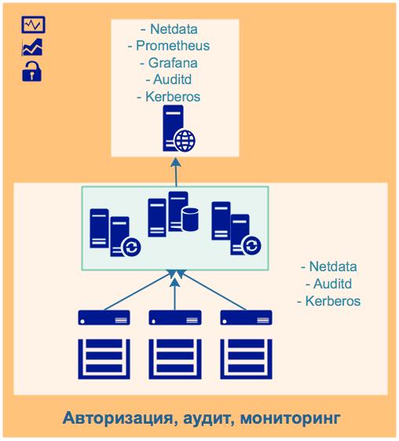

Мониторинг условно разделен на две части: реального времени и пассивную.

В мониторинге реального времени будем использовать [Netdata](https://github.com/netdata/netdata). Netdata на всех ВМ отличных от центральной (ns.otus.test) настроим в режиме Stream, что бы генерируемый поток метрик от каждого хоста пересылался центральному серверу Netdata.  
Центральный сервер настроим на прием метрик и их визуализацию. Если в нашем кластере происходят аномалии, то будет возможно наблюдать параметры, критичные для системы в реальном времени. У Netdata достаточно широкая функциональность, конечно в курсовом проекте ее невозможно охватить в полном объеме. 

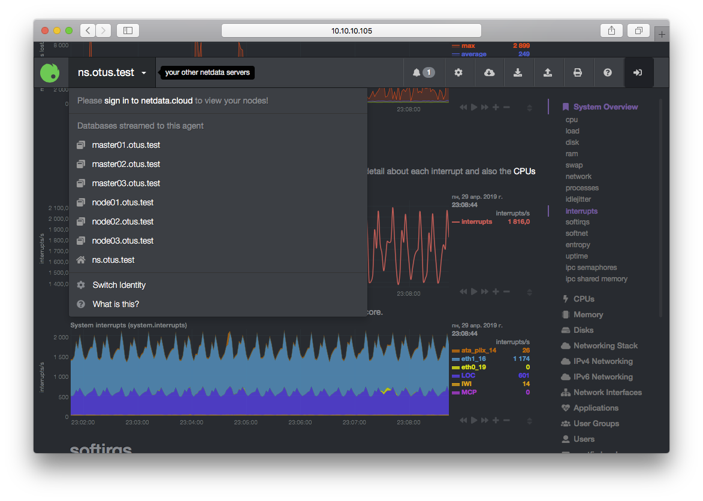

Пассивный мониторинг необходим для спокойного анализа причин возникновения проблем, которые привели к негативным последствиям. Для сбора метрик будем использовать возможность Netdata отдавать метрики в формате Prometheus. На ns.otus.test установим и настроим Prometheus, в [prometheus.yml](provision/roles/prometheus/templates/prometheus.yml.j2) определим endpoints для сбора метрик со всех нод стенда. Вместе с Prometheus установим `prometheus-postgresql-adapter`, службу, с помощью которой метрики будут записываться в базу данных. Как настроить для этого БД - описано выше. 

Схема работы коллектора метрик:

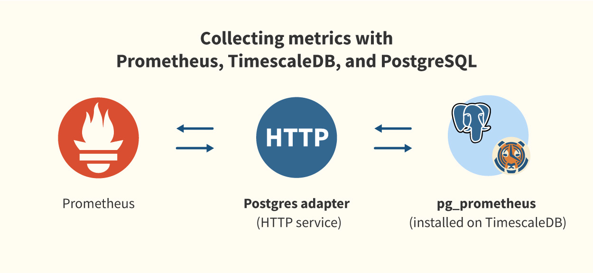

Рrometheus postgresql adapter так же можно настроить на работу в режиме [высокой доступности](https://blog.timescale.com/prometheus-ha-postgresql-8de68d19b6f5/). Внутри БД создается несколько таблиц (см. структуру таблиц, [документация](https://docs.timescale.com/v0.12/tutorials/prometheus-adapter)), куда попадают данные мониторинга.

Итого схема работы пассивного мониторинга: Netdata -> Prometheus -> prometheus-postgresql-adapter -> PostgesSQL+TimescaleDB+pg_prometheus -> Grafana

На ns.otus.test установим Grafana, создадим для нее демонстрационный dashboard, где будем отображать метрики, получая их с помощью SQL запросов из БД.

Пример sql запроса:

```sql
SELECT
  time_bucket ('1m', time) AS time,
  avg(value) as load_1m
FROM
  metrics
WHERE
  time BETWEEN $__timeFrom() AND $__timeTo()
  AND name = 'netdata_users_cpu_system_percentage_average'
  AND labels @> '{"instance": "ns:19999"}'
  GROUP BY 1
  ORDER BY 1 ASC;
```

Выберем все значения метрики `netdata_system_active_processes_processes_average` в интервале 10 минут от текущего значения времени c дискретностью 1 минута (time_bucket - функция timescaleDB), для хоста ns, сгруппируем и отсортируем полученные значения.

Готовый пример тестового [dashboard](provision/roles/grafana/files/dashboard.json). 

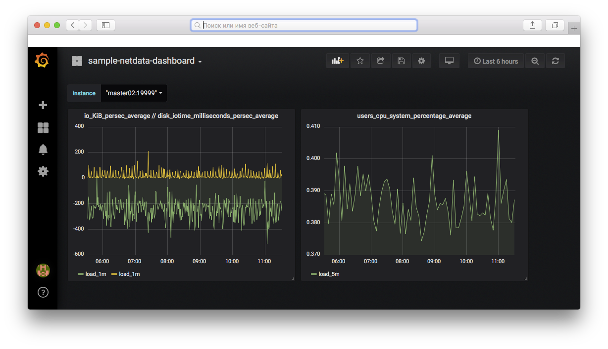

#### 2.4 Аудит

Аудит системных событий настроен по мотивам [ДЗ 14](https://github.com/kakoka/otus-homework/tree/master/hw14). Все ноды пересылают события аудита на ns.otus.test, [список правил](provision/roles/audit-client/templates/audit.rules.j2) аудита генерируется с помощью шаблона.

Общий краткий отчет о событиях в кластере:

<pre>
$ aureport

Summary Report
======================
Skipping line 37 in /etc/audit/auditd.conf: too long
Range of time in logs: 01/01/1970 03:00:00.000 - 04/30/2019 16:26:52.204
Selected time for report: 01/01/1970 03:00:00 - 04/30/2019 16:26:52.204
Number of changes in configuration: 0
Number of changes to accounts, groups, or roles: 3
Number of logins: 2
Number of failed logins: 0
Number of authentications: 4
Number of failed authentications: 0
Number of users: 2
Number of terminals: 8
Number of host names: 4
Number of executables: 20
Number of commands: 22
Number of files: 30
Number of AVC's: 0
Number of MAC events: 2
Number of failed syscalls: 18015
Number of anomaly events: 0
Number of responses to anomaly events: 0
Number of crypto events: 25
Number of integrity events: 0
Number of virt events: 0
Number of keys: 0
Number of process IDs: 14866
Number of events: 36719
</pre>

### 3. Развертывание инфраструктуры в облаке

#### 3.1 Доступ к Яндекс.Облаку

На локальной машине необходимо установить Yandex.Cloud CLI и выполнить начальные настройки:

```bash
$ curl https://storage.yandexcloud.net/yandexcloud-yc/install.sh | bash && source "/home/otus-user/.bashrc"
$ yc init
```

В процессе инициализации cli инструмента будут запрошены доступы Яндекс.Облака. Будет создан файл `~/.config/yandex-cloud/config.yaml`, с данными для доступа к облаку.

#### 3.2 Создание AWS S3 совместимого бакета и сервисного аккаунта

В веб консоли аккаунта Яндекс.Облака создаем объектное хранилище с именем `otus-infra`, внутри хранилища создаем папку `state`. К сожалению, cli инструментов для этих операции на сегодняшний момент нет.

#### 3.3 Пользователь otus-user, ssh-ключ

На облачную виртуальную машину будем заходить под пользователем `otus-user`. Сгенерируем для него ssh-ключи:

```bash
$ ssh-keygen -t rsa -b 4096 -f /home/otus-user/.ssh/otus-user-key -q -N ""
```

#### 3.4 Использование стартового скрипта

Скрипт `start.sh` создает первую машину в облаке, с которой будет разворачиваться инфрастукртура проекта. При создании ВМ устанавливаются необходимые инструменты для дальнейшей работы, генерируется файл metadata.yml. Так же внутрь новой ВМ в домашний каталог `otus-user` клонируется [репозиторий инфраструктуры проекта](https://github.com/kakoka/otus-infra.git). Публичная часть ключа `otus-user` должна быть включена в метаданные создаваемой ВМ.

Metadata - данные, которые будут применены скриптами cloud-init при старте ВМ в Яндекс.Облаке.

После старта ВМ необходимо зайти в нее по SSH и выполнить дальнейшую настройку:

```bash
$ ssh -i ~/.ssh/otus-user-key otus-user@$(yc compute instance get bastion --format json | jq -r '.network_interfaces[].primary_v4_address.one_to_one_nat.address')
```

#### 3.5 Настройка первой виртуальной машины в облаке

##### 3.5.1 Доступ к Яндекс.Облаку

Установим Yandex Cloud CLI:

```bash
$ curl https://storage.yandexcloud.net/yandexcloud-yc/install.sh | bash && source "/home/otus-user/.bashrc"
```

С локальной машины из `~/.config/yandex-cloud/config.yaml` возьмем конфигурацию cli (токен для доступа к Облаку) и перенесем на виртуальную в такой же файл и по такому же пути. Как альтернатива - можно выполнить команду `yc init`, получить токен и тд.

##### 3.5.2 Настройка и инициализация Terraform, импорт ранее созданных ресурсов

Убедимся, что в бакете отсутствует старый стейт Terraform. Если он есть, то его необходимо удалить для дальнейшей корректной работы при создании новой инфраструктуры.

В директории с кодом инфраструктуры проекта `~/otus-infra` необходимо выполнить инициализацию Terraform.

Для работы Terraform с Яндекс.Облаком необходим провайдер. Провайдер устанавливается автоматически при инициализации в директории с проектом, но для этого необходимы учетные данные из `~/.config/yandex-cloud/config.yaml`.

На этапе создания первой ВМ был сгенерирован новый ssh-ключ для доступа к новосоздаваемым ресурсам `~/.ssh/otus-user.pub`, этот ключ необходимо добавить в файл, содержащий метаданные виртуальных машин.

Инициализация Terraform выполняется с параметрами, так как мы создаем бэкенд, лежащий в объектном хранилище. Команда инициализации выглядит так:

```bash
$ terraform init -backend-config="access_key=key_id" -backend-config="secret_key=secret" -backend-config="bucket=state"
```

Необходимо создать сервисного пользователя, назначить ему права на каталог, в котором должна быть развернута инфраструктура и находится уже созданный бакет, а так же получить для него ключи доступа.

```bash
$ yc iam service-account create --name otus-user
$ yc iam access-key create --service-account-name otus-user
$ yc resource-manager folder add-access-binding **ИМЯ_КАТАЛОГА** --role editor --subject serviceAccount:**service_account_id**
```

Вывод команд будет следующим, здесь нам интересны два ключа `key_id`, `secret` и `service_account_id`, которые необходимо зафиксировать в безопасном месте:

<pre>
access_key:
 ...
 **key_id:** xxx...xxx
 **secret:** xxx....xxxxxx
</pre>

Из-за особенностей реализации Яндекс.Облака, между назначением прав пользователю на каталог и работой с ним должно пройти примерно 60 секунд.

В терминологии Terraform мы создаем backend, для хранения Terraform state, который необходим, если предполагается совместное использование этого инструмента.

На этапе создания стартовой ВМ, мы создали виртуальную сеть (my-network) и в ней подсеть (my-subnet). Эти же ресурсы мы описали с помощью терраформ. Заметим, что терраформ ничего не знает о том, что эти ресурсы уже созданы. Поэтому перед развертыванием полной инфраструктуры проекта необходимо выполнить импорт описанных и уже созданных ресурсов:

```bash
$ terraform import yandex_vpc_network.my-network network_id
$ terraform import yandex_vpc_subnet.my-subnet subnet_id
```

После этого шага все готово к развертыванию полной инфраструктуры проекта.

Для выполнения всех вышеперечисленных операций написан скрипт `init.sh`, его необходимо выполнить в директории с проектом `~/otus-infra`. Скрипт генерирует файлы `~/otus-infra/providers.tf` и `~/otus-infra/boostrap/metadata.yml` с нужными значениями, создаёт сервисного пользователя и инициализирует Terraform с нужными бэкендом, импортирует уже созданные ресурсы.

В скрипте в переменную `CATALOG` необходимо подставить имя каталога в облаке в котором будет происходить развертывание инфраструктуры (в новосозданном аккаунте обычно это каталог `default`).

#### 3.5.3 Развертывание инфраструктуры проекта

Для создания инфраструктуры:

```
$ terraform plan
$ terraform apply
```

Проверяем:

```
$ terraform state list
```


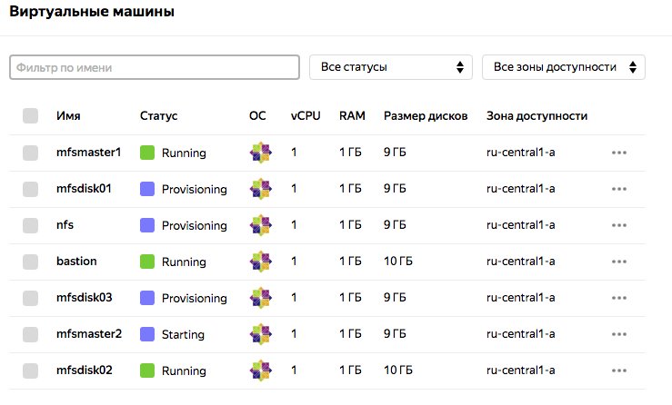

Дальнейшие шаги состоят в запуске ansible playbooks с нужными ролями для установки кластера LizardFS.  

### 4. Ссылки

#### LizardFS

- https://docs.lizardfs.com/
- http://www.micronarrativ.org/2016/2016-lizardfs.html
- https://habr.com/ru/post/343326/
- https://blogs.sungeek.net/unixwiz/2018/09/02/centos-7-postgresql-10-patroni/
- https://superuser.com/questions/1388611/unable-to-install-postgres-extension-pg-prometheus-and-prometheus-postgresql-ada

#### Prometheus, pg_prometheus, timescaledb, postgres

- https://github.com/timescale/pg_prometheus
- https://github.com/timescale/prometheus-postgresql-adapter
- https://github.com/timescale/timescaledb
- https://github.com/runejuhl/grafana-timescaledb
- https://docs.timescale.com/v1.2/tutorials/prometheus-adapter
- https://github.com/zalando/patroni/blob/master/docs/replica_bootstrap.rst

##### WAL-G

- https://github.com/g0djan/readme/blob/master/PostgreSQL.md
- https://github.com/afefelov/patroni-class

##### Grafana

- https://computingforgeeks.com/how-to-add-grafana-data-source-using-ansible/

##### Auditd

- https://luppeng.wordpress.com/2016/08/06/setting-up-centralized-logging-with-auditd/
- https://gist.githubusercontent.com/Neo23x0/9fe88c0c5979e017a389b90fd19ddfee/raw/f37173a62e2d54325b0e5d496ac51c37dfb4e37f/audit.rules

##### Terraform

- [Terraform. Разные AWS профили для S3 бэкенда и окружения](https://notessysadmin.com/terraform-different-aws-profiles-for-s3-backend-and-environment)
- [s3 bucket + terraform backend](https://medium.com/@jmarhee/digitalocean-spaces-as-a-terraform-backend-b761ae426086)
- [Importing Infrastructure in Terraform – Networking](https://ascisolutions.com/blog/2018/07/05/importing-infrastructure-in-terraform-networking/)
